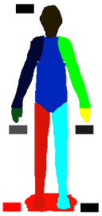
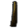
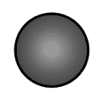
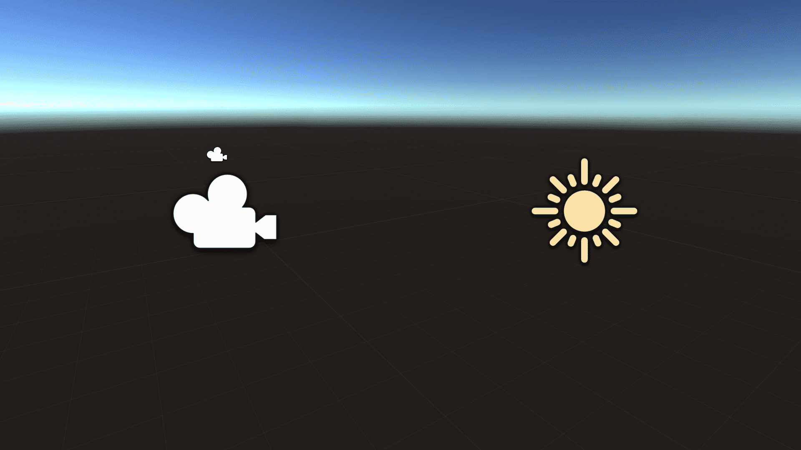
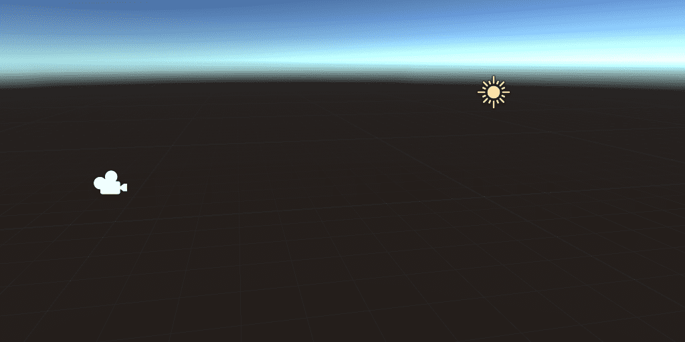
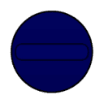
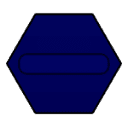
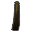

Unity Editor Built-in Icons
==============================
Unity version: **6000.0.32f1**
Icons that can be loaded via `EditorGUIUtility.IconContent`

Example: `EditorGUIUtility.IconContent("console.infoicon");`

Advanced Usage: [Install as Git package](https://github.com/Doppelkeks/UnityEditorIconScraper/wiki/Use-the-git-Package)

Icons
-------------

| Icon | Name | File ID |
|------|------|---------|
|  | `_Help` | `6012202242263741038` |
|  | `_Help@2x` | `4169196540306420147` |
|  | `_Menu` | `4484009487905280788` |
|  | `_Menu@2x` | `11312544851936486959` |
|  | `_Popup` | `17207803019791025812` |
|  | `_Popup@2x` | `16670822497846070531` |
|  | `aboutwindow.mainheader` | `7413624039758100214` |
|  | `aboutwindow.mainheader@2x` | `11555497547658218360` |
|  | `ageialogo` | `142239856772769874` |
|  | `AlphabeticalSorting` | `385791893351368358` |
|  | `AlphabeticalSorting@2x` | `7687558349484904409` |
|  | `AnchorTransformTool On` | `12505501436774151775` |
|  | `AnchorTransformTool On@2x` | `726274932638104148` |
|  | `AnchorTransformTool` | `723890132883790350` |
|  | `AnchorTransformTool@2x` | `16686147000429315813` |
|  | `Animation.AddEvent` | `4137659740751492990` |
|  | `Animation.AddEvent@2x` | `4559771996658765653` |
|  | `Animation.AddKeyframe` | `1899560698203370934` |
|  | `Animation.AddKeyframe@2x` | `4928525775237636745` |
|  | `Animation.EventMarker` | `9353139244199219161` |
|  | `Animation.EventMarker@2x` | `363374367590188809` |
|  | `Animation.FilterBySelection` | `4435535828786833316` |
|  | `Animation.FilterBySelection@2x` | `5496628722178675830` |
|  | `Animation.FirstKey` | `3024128271444096090` |
|  | `Animation.FirstKey@2x` | `12264208188038550933` |
|  | `Animation.LastKey` | `17555443813001304988` |
|  | `Animation.LastKey@2x` | `9351779743945132100` |
|  | `Animation.NextKey` | `14058231534925178045` |
|  | `Animation.NextKey@2x` | `11528853669645068884` |
|  | `Animation.Play` | `13402404240631112944` |
|  | `Animation.Play@2x` | `1241623811056693672` |
|  | `Animation.PrevKey` | `2990535490684037521` |
|  | `Animation.PrevKey@2x` | `2404351936869365903` |
|  | `Animation.Record` | `3223261772366079321` |
|  | `Animation.Record@2x` | `12622538830158180644` |
|  | `Animation.SequencerLink` | `4724545919325408663` |
|  | `animationanimated` | `3991419891476851759` |
|  | `animationanimated@2x` | `14489341245187523939` |
|  | `animationdopesheetkeyframe` | `17720217686319774946` |
|  | `animationkeyframe` | `18317613297440844193` |
|  | `animationkeyframe@2x` | `54921030647317439` |
|  | `animationnocurve` | `11572464206078427413` |
|  | `animationvisibilitytoggleoff` | `9833934302890606648` |
|  | `animationvisibilitytoggleoff@2x` | `2084219579258176148` |
|  | `animationvisibilitytoggleon` | `10879796006008106439` |
|  | `animationvisibilitytoggleon@2x` | `14809600280654322474` |
|  | `AnimationWrapModeMenu` | `17635313697562324133` |
|  | `AssemblyLock` | `10674696457642788265` |
|  | `Asset Store` | `357073275683767465` |
|  | `Asset Store@2x` | `14054895684433651511` |
|  | `Unity-AssetStore-Originals-Logo-White` | `9738462442837815672` |
|  | `Unity-AssetStore-Originals-Logo-White@2x` | `5141202327592148685` |
|  | `Audio Mixer` | `5436946869657106676` |
|  | `Audio Mixer@2x` | `923997255885558976` |
|  | `d_Pause` | `18270425065417862471` |
|  | `d_Pause@2x` | `5513754980864687971` |
|  | `d_Play` | `2840300199887526447` |
|  | `d_Play@2x` | `7097392774114191295` |
|  | `d_Skip` | `18295264038253665609` |
|  | `d_Skip@2x` | `18330381381101908345` |
|  | `d_Stop` | `13726811607090422063` |
|  | `d_Stop@2x` | `2021644824490632000` |
|  | `Pause` | `16259963677334450063` |
|  | `Pause@2x` | `8962986169007383491` |
|  | `Play` | `8189429188577072440` |
|  | `Play@2x` | `18371041150092654987` |
|  | `Skip` | `18175387266093808673` |
|  | `Skip@2x` | `3369782718960177557` |
|  | `Stop` | `11896983645249385331` |
|  | `Stop@2x` | `9627868765058149525` |
|  | `AutoLightbakingOff` | `3199249832511293691` |
|  | `AutoLightbakingOff@2x` | `11053691796771622357` |
|  | `AutoLightbakingOn` | `10614611402033845641` |
|  | `AutoLightbakingOn@2x` | `5360101526799613901` |
|  | `AvatarCompass` | `14259573952296190037` |
|  | `AvatarController.Layer` | `11029833850949141606` |
|  | `AvatarController.LayerHover` | `1060193532816808308` |
|  | `AvatarController.LayerSelected` | `3582037340827626199` |
|  | `BodyPartPicker` | `14856310084610317250` |
|  | `BodySilhouette` | `13995431784192443049` |
|  | `DotFill` | `10213501863658447446` |
|  | `DotFrame` | `7869005827914783879` |
|  | `DotFrameDotted` | `15297832418724377667` |
|  | `DotSelection` | `14963746504668389301` |
|  | `Head` | `3170944555394327123` |
|  | `HeadIk` | `17306420199630223993` |
|  | `HeadZoom` | `5257450994311700591` |
|  | `HeadZoomSilhouette` | `7762936895225980166` |
|  | `LeftArm` | `6123190672307434784` |
|  | `LeftFeetIk` | `7545747472747947336` |
|  | `LeftFingers` | `16804292938425514236` |
|  | `LeftFingersIk` | `1748729859595675987` |
|  | `LeftHandZoom` | `1621456644947490004` |
|  | `LeftHandZoomSilhouette` | `8384039629936793124` |
|  | `LeftLeg` | `4921818627043158325` |
|  | `MaskEditor_Root` | `4804520092827026396` |
|  | `RightArm` | `1833656670869755110` |
|  | `RightFeetIk` | `3710563382436173543` |
|  | `RightFingers` | `15057625562019211777` |
|  | `RightFingersIk` | `3975814432022212013` |
|  | `RightHandZoom` | `1596608304540055736` |
|  | `RightHandZoomSilhouette` | `4529296075431145259` |
|  | `RightLeg` | `16969879469917051236` |
|  | `Torso` | `9456238871563319237` |
|  | `AvatarPivot` | `13673186144361932652` |
|  | `AvatarPivot@2x` | `14225135427076567979` |
|  | `AvatarSelector` | `3140210110609189590` |
|  | `AvatarSelector@2x` | `1207210223992105847` |
|  | `back` | `320677636847005385` |
|  | `back@2x` | `10946994699914872223` |
|  | `beginButton-On` | `14122172584645771874` |
|  | `beginButton` | `10870283924250504718` |
|  | `blendKey` | `6036928476410329760` |
|  | `blendKey@2x` | `16049666155474872023` |
|  | `blendKeyOverlay` | `4617552029562368530` |
|  | `blendKeyOverlay@2x` | `958581468013483940` |
|  | `blendKeySelected` | `16939885320311430029` |
|  | `blendKeySelected@2x` | `13116459329725235449` |
|  | `blendSampler` | `7624220810582456138` |
|  | `blueGroove` | `17240529958301207688` |
|  | `d_UnityProduct` | `17248889488587620780` |
|  | `d_UnityProduct@2x` | `13406181427703165626` |
|  | `UnityProduct` | `14339976483235843587` |
|  | `UnityProduct@2x` | `14690463018896267430` |
|  | `BuildSettings.Android On` | `16567853813046882827` |
|  | `BuildSettings.Android On@2x` | `16334440819132706` |
|  | `BuildSettings.Android` | `15221442858503965502` |
|  | `BuildSettings.Android.Small` | `17280102285525317361` |
|  | `BuildSettings.Android.Small@2x` | `12501291619533818028` |
|  | `BuildSettings.Android@2x` | `5734965202261760406` |
|  | `BuildSettings.Broadcom` | `15835203730191405439` |
|  | `BuildSettings.DedicatedServer On` | `3297296290159596267` |
|  | `BuildSettings.DedicatedServer On@2x` | `5919977954002937266` |
|  | `BuildSettings.DedicatedServer` | `3815258833528828467` |
|  | `BuildSettings.DedicatedServer.Small` | `10799470104035692367` |
|  | `BuildSettings.DedicatedServer.Small@2x` | `12388221583423306506` |
|  | `BuildSettings.DedicatedServer@2x` | `6769625271997971160` |
|  | `BuildSettings.Editor` | `8400232691031406736` |
|  | `BuildSettings.Editor.Small` | `11538033815661468441` |
|  | `BuildSettings.EmbeddedLinux On` | `7335244815113920615` |
|  | `BuildSettings.EmbeddedLinux On@2x` | `1354193150461728072` |
|  | `BuildSettings.EmbeddedLinux` | `15549903817543734813` |
|  | `BuildSettings.EmbeddedLinux.Small` | `15237533412772240527` |
|  | `BuildSettings.EmbeddedLinux.Small@2x` | `14558020418496631853` |
|  | `BuildSettings.EmbeddedLinux@2x` | `16289586551500325165` |
|  | `BuildSettings.Facebook On` | `10587032395174762701` |
|  | `BuildSettings.Facebook On@2x` | `17163385387706580629` |
|  | `BuildSettings.Facebook` | `12961162838266944425` |
|  | `BuildSettings.Facebook.Small` | `5439670708184688316` |
|  | `BuildSettings.Facebook.Small@2x` | `9115517695639967145` |
|  | `BuildSettings.Facebook@2x` | `15521473341696701866` |
|  | `BuildSettings.FlashPlayer` | `466988226579792567` |
|  | `BuildSettings.FlashPlayer.Small` | `4366120842335875659` |
|  | `BuildSettings.GameCoreScarlett On` | `4032073047827678025` |
|  | `BuildSettings.GameCoreScarlett On@2x` | `7612008437288004200` |
|  | `BuildSettings.GameCoreScarlett` | `438378150247721864` |
|  | `BuildSettings.GameCoreScarlett.Small` | `9266847059636730811` |
|  | `BuildSettings.GameCoreScarlett.Small@2x` | `10794833542506715865` |
|  | `BuildSettings.GameCoreScarlett@2x` | `9339874982397101632` |
|  | `BuildSettings.GameCoreXboxOne On` | `7548485100206320310` |
|  | `BuildSettings.GameCoreXboxOne On@2x` | `991673151852721335` |
|  | `BuildSettings.GameCoreXboxOne` | `3068716228704556637` |
|  | `BuildSettings.GameCoreXboxOne.Small` | `4089031816727803355` |
|  | `BuildSettings.GameCoreXboxOne.Small@2x` | `2145091974174636302` |
|  | `BuildSettings.GameCoreXboxOne@2x` | `7098168344539396557` |
|  | `BuildSettings.iPhone On` | `5315025538136271434` |
|  | `BuildSettings.iPhone On@2x` | `3856988739857600585` |
|  | `BuildSettings.iPhone` | `3079519598310828125` |
|  | `BuildSettings.iPhone.Small` | `4345870033486632634` |
|  | `BuildSettings.iPhone.Small@2x` | `12812219209644522370` |
|  | `BuildSettings.iPhone@2x` | `6987697712259842190` |
|  | `BuildSettings.Linux` | `10303421534824007390` |
|  | `BuildSettings.Linux.Small` | `3567089156471553452` |
|  | `BuildSettings.Linux.Small@2x` | `12084983190006168425` |
|  | `BuildSettings.Linux@2x` | `3764582336549979051` |
|  | `BuildSettings.LinuxHeadlessSimulation On` | `10933362478146913075` |
|  | `BuildSettings.LinuxHeadlessSimulation On@2x` | `14046116371762625227` |
|  | `BuildSettings.LinuxHeadlessSimulation` | `9489037759579094224` |
|  | `BuildSettings.LinuxHeadlessSimulation.Small` | `7705685685023676459` |
|  | `BuildSettings.LinuxHeadlessSimulation.Small@2x` | `6676424620479421655` |
|  | `BuildSettings.LinuxHeadlessSimulation@2x` | `9461662138805933943` |
|  | `BuildSettings.Lumin On` | `11024959971569892920` |
|  | `BuildSettings.Lumin On@2x` | `2998448140356953732` |
|  | `BuildSettings.Lumin` | `13231519482037792171` |
|  | `BuildSettings.Lumin.small` | `8979687790990599924` |
|  | `BuildSettings.Lumin.small@2x` | `17714949889848130219` |
|  | `BuildSettings.Lumin@2x` | `13279926728961440701` |
|  | `BuildSettings.Metro On` | `3455818660745422868` |
|  | `BuildSettings.Metro On@2x` | `6720285510691535691` |
|  | `BuildSettings.Metro` | `14425739347706101384` |
|  | `BuildSettings.Metro.Small` | `8056438331138731872` |
|  | `BuildSettings.Metro.Small@2x` | `9714508685552772626` |
|  | `BuildSettings.Metro@2x` | `16134964038342597023` |
|  | `BuildSettings.N3DS On` | `6165003963721005565` |
|  | `BuildSettings.N3DS On@2x` | `8791219912215951517` |
|  | `BuildSettings.N3DS` | `12538573633704237160` |
|  | `BuildSettings.N3DS.Small` | `12379944791376337009` |
|  | `BuildSettings.N3DS.Small@2x` | `2057369963675073982` |
|  | `BuildSettings.N3DS@2x` | `12015914881122320363` |
|  | `BuildSettings.OSX` | `5732989794339194379` |
|  | `BuildSettings.OSX.Small` | `3544963573631410847` |
|  | `BuildSettings.OSX.Small@2x` | `11192257126856581067` |
|  | `BuildSettings.OSX@2x` | `5336092474376659068` |
|  | `BuildSettings.PS4 On` | `16000230919711648354` |
|  | `BuildSettings.PS4 On@2x` | `7838709373500781874` |
|  | `BuildSettings.PS4` | `55494050528514414` |
|  | `BuildSettings.PS4.Small` | `2298978507677022530` |
|  | `BuildSettings.PS4.Small@2x` | `16033004665060394621` |
|  | `BuildSettings.PS4@2x` | `11918764783347905678` |
|  | `BuildSettings.PS5 On` | `6012666984125897113` |
|  | `BuildSettings.PS5 On@2x` | `5021112018744779014` |
|  | `BuildSettings.PS5` | `10302025284091359696` |
|  | `BuildSettings.PS5.Small` | `8521832537410238816` |
|  | `BuildSettings.PS5.Small@2x` | `7719912845452673205` |
|  | `BuildSettings.PS5@2x` | `373751416080676096` |
|  | `BuildSettings.PSM` | `18348653602848243124` |
|  | `BuildSettings.PSM.Small` | `17730956105551105090` |
|  | `BuildSettings.PSP2` | `9006858688270511880` |
|  | `BuildSettings.PSP2.Small` | `16189434911440881457` |
|  | `BuildSettings.QNX On` | `8649443330007599567` |
|  | `BuildSettings.QNX On@2x` | `651470099042661747` |
|  | `BuildSettings.QNX` | `1050841081343024967` |
|  | `BuildSettings.QNX.Small` | `17456903762372551025` |
|  | `BuildSettings.QNX.Small@2x` | `8699015482324335218` |
|  | `BuildSettings.QNX@2x` | `6676897800958288455` |
|  | `BuildSettings.SceneList` | `14498985739867106443` |
|  | `BuildSettings.SelectedIcon` | `15209441389784905389` |
|  | `BuildSettings.Stadia On` | `17863333141772116383` |
|  | `BuildSettings.Stadia On@2x` | `16018807054337747609` |
|  | `BuildSettings.Stadia` | `17387132815158506648` |
|  | `BuildSettings.Stadia.small` | `16464567128892178378` |
|  | `BuildSettings.Stadia.Small@2x` | `8703136191750934175` |
|  | `BuildSettings.Stadia@2x` | `3805792301904044692` |
|  | `BuildSettings.Standalone On` | `10414111762127206601` |
|  | `BuildSettings.Standalone On@2x` | `4576219794024598259` |
|  | `BuildSettings.Standalone` | `9405492931148757848` |
|  | `BuildSettings.Standalone.Small` | `4297135980918140731` |
|  | `BuildSettings.Standalone.Small@2x` | `8897440368062136615` |
|  | `BuildSettings.Standalone@2x` | `3214811950287853606` |
|  | `BuildSettings.StandaloneBroadcom.Small` | `9541400643673778547` |
|  | `BuildSettings.StandaloneGLES20Emu.Small` | `2723429009875258330` |
|  | `BuildSettings.StandaloneGLESEmu` | `17136458723933452681` |
|  | `BuildSettings.StandaloneGLESEmu.Small` | `6677928742535971017` |
|  | `BuildSettings.Switch On` | `5706999980759659277` |
|  | `BuildSettings.Switch On@2x` | `18385481121689175964` |
|  | `BuildSettings.Switch` | `5517785097875794962` |
|  | `BuildSettings.Switch.Small` | `8765560747129780117` |
|  | `BuildSettings.Switch.Small@2x` | `14456684032477727445` |
|  | `BuildSettings.Switch@2x` | `4203361953608673628` |
|  | `BuildSettings.tvOS On` | `16563153300159069640` |
|  | `BuildSettings.tvOS On@2x` | `15630968276152113288` |
|  | `BuildSettings.tvOS` | `15842236667162523608` |
|  | `BuildSettings.tvOS.Small` | `2324412021468308913` |
|  | `BuildSettings.tvOS.Small@2x` | `9180157117389547636` |
|  | `BuildSettings.tvOS@2x` | `17070116595537327179` |
|  | `BuildSettings.visionOS On` | `9124571375880852433` |
|  | `BuildSettings.visionOS On.Small` | `8153865458331637261` |
|  | `BuildSettings.visionOS On.Small@2x` | `2544838280791519609` |
|  | `BuildSettings.visionOS On@2x` | `1894222060145787484` |
|  | `BuildSettings.visionOS` | `7255139279651513950` |
|  | `BuildSettings.visionOS.small` | `5988672859772047745` |
|  | `BuildSettings.visionOS.small@2x` | `14216208907019857387` |
|  | `BuildSettings.visionOS@2x` | `3766923774201948693` |
|  | `BuildSettings.Web` | `10373062146146291137` |
|  | `BuildSettings.Web.Small` | `9944127417560150743` |
|  | `BuildSettings.WebGL On` | `4781758196249721453` |
|  | `BuildSettings.WebGL On@2x` | `12262717684576643354` |
|  | `BuildSettings.WebGL` | `13535187283738865111` |
|  | `BuildSettings.WebGL.Small` | `15179573300282965917` |
|  | `BuildSettings.WebGL.Small@2x` | `7777299662375183282` |
|  | `BuildSettings.WebGL@2x` | `17850054313171675907` |
|  | `BuildSettings.Windows` | `6950411709033133733` |
|  | `BuildSettings.Windows.Small` | `9473035528025746291` |
|  | `BuildSettings.Windows.Small@2x` | `2331217329389106139` |
|  | `BuildSettings.Windows@2x` | `15697923680134285336` |
|  | `BuildSettings.WP8` | `8103707556279304917` |
|  | `BuildSettings.WP8.Small` | `17425565723490860627` |
|  | `BuildSettings.Xbox360` | `15409550765404113202` |
|  | `BuildSettings.Xbox360.Small` | `17267556949199296176` |
|  | `BuildSettings.XboxOne On` | `11869893910636873720` |
|  | `BuildSettings.XboxOne On@2x` | `7572160625161521045` |
|  | `BuildSettings.XboxOne` | `5149289017103940624` |
|  | `BuildSettings.XboxOne.Small` | `18200916589577334283` |
|  | `BuildSettings.XboxOne.Small@2x` | `389319431642934349` |
|  | `BuildSettings.XboxOne@2x` | `3546431289802905298` |
|  | `CacheServerConnected` | `6237473061563373096` |
|  | `CacheServerConnected@2x` | `5286386693594080902` |
|  | `CacheServerDisabled` | `1688511831137845510` |
|  | `CacheServerDisabled@2x` | `3350491704846691845` |
|  | `CacheServerDisconnected` | `185745745770690484` |
|  | `CacheServerDisconnected@2x` | `14613465757052420267` |
|  | `CheckerFloor` | `11148775555118504728` |
|  | `Clipboard` | `6367713590482950888` |
|  | `ClothInspector.PaintTool` | `1624265540036763281` |
|  | `ClothInspector.PaintValue` | `2134799571607069742` |
|  | `ClothInspector.SelectTool` | `9194464402604369906` |
|  | `ClothInspector.SettingsTool` | `12937696119377485751` |
|  | `ClothInspector.ViewValue` | `9758195593615429164` |
|  | `CloudConnect` | `1796978947134172663` |
|  | `CloudConnect@2x` | `15692970574867582175` |
|  | `Collab.Build` | `12254828366890689841` |
|  | `Collab.BuildFailed` | `13009305453437358973` |
|  | `Collab.BuildSucceeded` | `5057284793689411865` |
|  | `Collab.FileAdded` | `6445321136183198910` |
|  | `Collab.FileConflict` | `4336985247694938811` |
|  | `Collab.FileDeleted` | `6324715908799697015` |
|  | `Collab.FileIgnored` | `5400097563507297522` |
|  | `Collab.FileMoved` | `15716444687661412377` |
|  | `Collab.FileUpdated` | `1417162553530547262` |
|  | `Collab.FolderAdded` | `17236465819558603528` |
|  | `Collab.FolderConflict` | `8903646916365696551` |
|  | `Collab.FolderDeleted` | `735796692002808257` |
|  | `Collab.FolderIgnored` | `16475792788318963289` |
|  | `Collab.FolderMoved` | `8020716426326303056` |
|  | `Collab.FolderUpdated` | `10111680433216835635` |
|  | `Collab.NoInternet` | `11839102807249008396` |
|  | `Collab` | `12287974347535431003` |
|  | `Collab.Warning` | `11260255057027091061` |
|  | `Collab@2x` | `18241842386705410224` |
|  | `CollabConflict` | `7544789595935200320` |
|  | `CollabError` | `10212611425614970802` |
|  | `CollabNew` | `9741714632504618474` |
|  | `CollabOffline` | `8796122042331125716` |
|  | `CollabProgress` | `13310177087731603490` |
|  | `CollabPull` | `9959294134603076403` |
|  | `CollabPush` | `14225703575661805483` |
|  | `ColorPicker.ColorCycle` | `886907316228417740` |
|  | `ColorPicker.CycleColor` | `14882631325574665384` |
|  | `ColorPicker.CycleSlider` | `14932910393847973282` |
|  | `ColorPicker.SliderCycle` | `11363268116914643233` |
|  | `console.erroricon.inactive.sml` | `3590839462479323251` |
|  | `console.erroricon.inactive.sml@2x` | `15452167333168636513` |
|  | `console.erroricon` | `1715859669443758926` |
|  | `console.erroricon.sml` | `16441370924228369999` |
|  | `console.erroricon.sml@2x` | `8987726391556715404` |
|  | `console.erroricon@2x` | `6284689507932306902` |
|  | `console.infoicon.inactive.sml` | `17612563037415773762` |
|  | `console.infoicon.inactive.sml@2x` | `11026917728747305165` |
|  | `console.infoicon` | `11296334133193126909` |
|  | `console.infoicon.sml` | `5425037494185492166` |
|  | `console.infoicon.sml@2x` | `13286200162308293884` |
|  | `console.infoicon@2x` | `17612344433079560320` |
|  | `console.warnicon.inactive.sml` | `2636775829707929427` |
|  | `console.warnicon.inactive.sml@2x` | `15066644777238083776` |
|  | `console.warnicon` | `2655493458141633029` |
|  | `console.warnicon.sml` | `12682923911304054816` |
|  | `console.warnicon.sml@2x` | `15108377921054973799` |
|  | `console.warnicon@2x` | `3345359830406526867` |
|  | `CreateAddNew` | `5612988733227447382` |
|  | `CreateAddNew@2x` | `2537850299970768384` |
|  | `CrossIcon` | `10454746985417887103` |
|  | `curvekeyframe` | `12711430309745521441` |
|  | `curvekeyframe@2x` | `7341072774159052384` |
|  | `curvekeyframeselected` | `8557251948433319039` |
|  | `curvekeyframeselected@2x` | `4181363336114948910` |
|  | `curvekeyframeselectedoverlay` | `4691473716350331671` |
|  | `curvekeyframeselectedoverlay@2x` | `7875830917259516073` |
|  | `curvekeyframesemiselectedoverlay` | `17694391760757436906` |
|  | `curvekeyframesemiselectedoverlay@2x` | `7164663534835563533` |
|  | `curvekeyframeweighted` | `2608427245204659800` |
|  | `curvekeyframeweighted@2x` | `13526710380618624288` |
|  | `CustomSorting` | `1223667551903327650` |
|  | `CustomTool` | `6092978192067049055` |
|  | `CustomTool@2x` | `7660263989159558545` |
|  | `d__Help` | `4574346317732048352` |
|  | `d__Help@2x` | `8209119591668177465` |
|  | `d__Menu` | `255284738923976659` |
|  | `d__Menu@2x` | `4417794529297650604` |
|  | `d__Popup` | `5527209713546761551` |
|  | `d__Popup@2x` | `3415297583445976952` |
|  | `d_aboutwindow.mainheader` | `13184930065829581950` |
|  | `d_aboutwindow.mainheader@2x` | `10908961299724319023` |
|  | `d_ageialogo` | `14371939054960505980` |
|  | `d_AlphabeticalSorting` | `4704375340429805257` |
|  | `d_AlphabeticalSorting@2x` | `8188608333265313135` |
|  | `d_AnchorTransformTool On` | `2674281924599343872` |
|  | `d_AnchorTransformTool On@2x` | `15154459142972461529` |
|  | `d_AnchorTransformTool` | `6856279758526228965` |
|  | `d_AnchorTransformTool@2x` | `4866097001312715500` |
|  | `d_Animation.AddEvent` | `5580871185958974552` |
|  | `d_Animation.AddEvent@2x` | `10822875053752828226` |
|  | `d_Animation.AddKeyframe` | `12578504337896998428` |
|  | `d_Animation.AddKeyframe@2x` | `15670627339131748990` |
|  | `d_Animation.EventMarker` | `4865330878740040390` |
|  | `d_Animation.EventMarker@2x` | `11643329146717381406` |
|  | `d_Animation.FilterBySelection` | `15052323359389718705` |
|  | `d_Animation.FilterBySelection@2x` | `4939039871414479757` |
|  | `d_Animation.FirstKey` | `3960224646933354229` |
|  | `d_Animation.FirstKey@2x` | `14738355521496022536` |
|  | `d_Animation.LastKey` | `14331029577895553593` |
|  | `d_Animation.LastKey@2x` | `6052967016156083927` |
|  | `d_Animation.NextKey` | `5594613797062276571` |
|  | `d_Animation.NextKey@2x` | `5596665190693250607` |
|  | `d_Animation.Play` | `9786254225787466636` |
|  | `d_Animation.Play@2x` | `5504932610587006541` |
|  | `d_Animation.PrevKey` | `7684763639276239761` |
|  | `d_Animation.PrevKey@2x` | `12216887086460571595` |
|  | `d_Animation.Record` | `6569083827624595240` |
|  | `d_Animation.Record@2x` | `8982227325937526715` |
|  | `d_Animation.SequencerLink` | `1211459679570569961` |
|  | `d_animationanimated` | `10978915843906816057` |
|  | `d_animationanimated@2x` | `11774972728212476049` |
|  | `d_animationkeyframe` | `4997269261844303601` |
|  | `d_animationkeyframe@2x` | `6827032349305691703` |
|  | `d_animationnocurve` | `7669471596081897553` |
|  | `d_animationvisibilitytoggleoff` | `4907371712499317586` |
|  | `d_animationvisibilitytoggleoff@2x` | `17366650600952787229` |
|  | `d_animationvisibilitytoggleon` | `13818420679204164227` |
|  | `d_animationvisibilitytoggleon@2x` | `15848720397551971373` |
|  | `d_AnimationWrapModeMenu` | `5158551771503169309` |
|  | `d_AS Badge Delete` | `301681052602819724` |
|  | `d_AS Badge New` | `11226715904368225541` |
|  | `d_AssemblyLock` | `1997798467560094451` |
|  | `d_Asset Store` | `9752827523829355319` |
|  | `d_Asset Store@2x` | `11002198121609955338` |
|  | `d_Audio Mixer` | `2344599766593239149` |
|  | `d_Audio Mixer@2x` | `15162841936268674767` |
|  | `d_AutoLightbakingOff` | `2955618777930367874` |
|  | `d_AutoLightbakingOff@2x` | `7639127569424470396` |
|  | `d_AutoLightbakingOn` | `11095174895933269396` |
|  | `d_AutoLightbakingOn@2x` | `5223064176733806433` |
|  | `d_AvatarBlendBackground` | `10706073411559539354` |
|  | `d_AvatarBlendLeft` | `6392251390363527398` |
|  | `d_AvatarBlendLeftA` | `1513400179016092070` |
|  | `d_AvatarBlendRight` | `18009397522301749356` |
|  | `d_AvatarBlendRightA` | `12104066098237480669` |
|  | `d_AvatarCompass` | `9167206752844903456` |
|  | `d_AvatarPivot` | `2269904091327538262` |
|  | `d_AvatarPivot@2x` | `17512779877416465182` |
|  | `d_AvatarSelector` | `291972862006145974` |
|  | `d_AvatarSelector@2x` | `4374373771682133825` |
|  | `d_back` | `7491503434607560644` |
|  | `d_back@2x` | `9130732976430192545` |
|  | `d_beginButton-On` | `16904837092736923424` |
|  | `d_beginButton` | `9812525293850727004` |
|  | `d_blueGroove` | `3958074764286187482` |
|  | `d_BuildSettings.Android` | `15000007766358513186` |
|  | `d_BuildSettings.Android.Small` | `6296815224293940132` |
|  | `d_BuildSettings.Android.Small@2x` | `11226385323827600191` |
|  | `d_BuildSettings.Android@2x` | `16442073252976282708` |
|  | `d_BuildSettings.Broadcom` | `9438017624627663019` |
|  | `d_BuildSettings.DedicatedServer` | `2578505128784497995` |
|  | `d_BuildSettings.DedicatedServer.Small` | `16312079666169485690` |
|  | `d_BuildSettings.DedicatedServer.Small@2x` | `3327166165389737355` |
|  | `d_BuildSettings.DedicatedServer@2x` | `5944582379227412270` |
|  | `d_BuildSettings.Facebook` | `4036877365744175712` |
|  | `d_BuildSettings.Facebook.Small` | `16673508450783681539` |
|  | `d_BuildSettings.Facebook.Small@2x` | `16923134668927548160` |
|  | `d_BuildSettings.Facebook@2x` | `1063348289580890539` |
|  | `d_BuildSettings.FlashPlayer` | `16141139026867097954` |
|  | `d_BuildSettings.FlashPlayer.Small` | `731514638995218830` |
|  | `d_BuildSettings.GameCoreScarlett` | `12491435176012445184` |
|  | `d_BuildSettings.GameCoreScarlett.Small` | `11794222865762080832` |
|  | `d_BuildSettings.GameCoreScarlett.Small@2x` | `11451379984073831654` |
|  | `d_BuildSettings.GameCoreScarlett@2x` | `17337829817904826568` |
|  | `d_BuildSettings.GameCoreXboxOne` | `17614305203796163856` |
|  | `d_BuildSettings.GameCoreXboxOne.Small` | `1014862496525268134` |
|  | `d_BuildSettings.GameCoreXboxOne.Small@2x` | `5323906888130457667` |
|  | `d_BuildSettings.GameCoreXboxOne@2x` | `10206353529262375491` |
|  | `d_BuildSettings.iPhone` | `12187226993881624710` |
|  | `d_BuildSettings.iPhone.Small` | `17365751328850723156` |
|  | `d_BuildSettings.iPhone.Small@2x` | `4152198871333242844` |
|  | `d_BuildSettings.iPhone@2x` | `10185918880377734387` |
|  | `d_BuildSettings.Linux` | `7138347608523357709` |
|  | `d_BuildSettings.Linux.Small` | `14100766666812403441` |
|  | `d_BuildSettings.Linux.Small@2x` | `12592710216209988205` |
|  | `d_BuildSettings.Linux@2x` | `7295335864922443843` |
|  | `d_BuildSettings.LinuxHeadlessSimulation` | `11517956995628393349` |
|  | `d_BuildSettings.LinuxHeadlessSimulation.Small` | `12045737191083635073` |
|  | `d_BuildSettings.LinuxHeadlessSimulation.Small@2x` | `14211452702701842192` |
|  | `d_BuildSettings.LinuxHeadlessSimulation@2x` | `731831657698283869` |
|  | `d_BuildSettings.Lumin` | `6535942805984192183` |
|  | `d_BuildSettings.Lumin.small` | `15605165006671109293` |
|  | `d_BuildSettings.Lumin.small@2x` | `2381741023756229166` |
|  | `d_BuildSettings.Lumin@2x` | `16922329039458500960` |
|  | `d_BuildSettings.Metro` | `3599409261634019790` |
|  | `d_BuildSettings.Metro.Small` | `1784067418094738445` |
|  | `d_BuildSettings.Metro.Small@2x` | `16948833881440325525` |
|  | `d_BuildSettings.Metro@2x` | `889119860637441237` |
|  | `d_BuildSettings.N3DS` | `1548403576493293022` |
|  | `d_BuildSettings.N3DS.Small` | `5168174702038070723` |
|  | `d_BuildSettings.N3DS.Small@2x` | `9603704327509911072` |
|  | `d_BuildSettings.N3DS@2x` | `12266206678977536566` |
|  | `d_BuildSettings.OSX` | `10576784765693874797` |
|  | `d_BuildSettings.OSX.Small` | `8518898020541173724` |
|  | `d_BuildSettings.OSX.Small@2x` | `7714420375933168765` |
|  | `d_BuildSettings.OSX@2x` | `12645132319742644671` |
|  | `d_BuildSettings.PS4` | `9035645644763246296` |
|  | `d_BuildSettings.PS4.Small` | `17119965637404815578` |
|  | `d_BuildSettings.PS4.Small@2x` | `9805256919035797035` |
|  | `d_BuildSettings.PS4@2x` | `4572901898994548769` |
|  | `d_BuildSettings.PS5` | `13154706226960619736` |
|  | `d_BuildSettings.PS5.Small` | `4660124725284368101` |
|  | `d_BuildSettings.PS5.Small@2x` | `5350496758064582428` |
|  | `d_BuildSettings.PS5@2x` | `14072383583324359572` |
|  | `d_BuildSettings.PSP2` | `672497611671670674` |
|  | `d_BuildSettings.PSP2.Small` | `12956730423535298516` |
|  | `d_BuildSettings.QNX` | `1732572143302613247` |
|  | `d_BuildSettings.QNX.Small` | `6146449108786339081` |
|  | `d_BuildSettings.QNX.Small@2x` | `13959103658771322713` |
|  | `d_BuildSettings.QNX@2x` | `2190123638057228037` |
|  | `d_BuildSettings.SelectedIcon` | `12808581904402027562` |
|  | `d_BuildSettings.Stadia` | `41120884009361448` |
|  | `d_BuildSettings.Stadia.Small` | `6365604532169879272` |
|  | `d_BuildSettings.Stadia.Small@2x` | `15530415618944646451` |
|  | `d_BuildSettings.Stadia@2x` | `17763584051972766915` |
|  | `d_BuildSettings.Standalone` | `14865446076646911655` |
|  | `d_BuildSettings.Standalone.Small` | `382013416940812573` |
|  | `d_BuildSettings.Standalone.Small@2x` | `16317136498526712966` |
|  | `d_BuildSettings.Standalone@2x` | `16676681178606811265` |
|  | `d_BuildSettings.Switch` | `11861474433166315843` |
|  | `d_BuildSettings.Switch.Small` | `2920198948148501075` |
|  | `d_BuildSettings.Switch.Small@2x` | `6822354511494598398` |
|  | `d_BuildSettings.Switch@2x` | `17320907110930849466` |
|  | `d_BuildSettings.tvOS` | `3261360856959884992` |
|  | `d_BuildSettings.tvOS.Small` | `14217153188483593208` |
|  | `d_BuildSettings.tvOS.Small@2x` | `10556982365194677201` |
|  | `d_BuildSettings.tvOS@2x` | `9036554527568043497` |
|  | `d_BuildSettings.visionOS On` | `4996179576366871280` |
|  | `d_BuildSettings.visionOS On.Small` | `14667386506241000825` |
|  | `d_BuildSettings.visionOS On.Small@2x` | `8644578333387699008` |
|  | `d_BuildSettings.visionOS On@2x` | `13837554117012490147` |
|  | `d_BuildSettings.visionOS` | `14693545522397811617` |
|  | `d_BuildSettings.visionOS.Small` | `12342156293599765139` |
|  | `d_BuildSettings.visionOS.Small@2x` | `7551791107370717883` |
|  | `d_BuildSettings.visionOS@2x` | `9686729998718163318` |
|  | `d_BuildSettings.Web` | `169656382621208501` |
|  | `d_BuildSettings.Web.Small` | `15372346599368443480` |
|  | `d_BuildSettings.WebGL` | `13641415576650983802` |
|  | `d_BuildSettings.WebGL.Small` | `3315521960194682417` |
|  | `d_BuildSettings.WebGL.Small@2x` | `15096985786702627526` |
|  | `d_BuildSettings.WebGL@2x` | `11546206168827616444` |
|  | `d_BuildSettings.Windows` | `15868269537338841279` |
|  | `d_BuildSettings.Windows.Small` | `8327636491067668638` |
|  | `d_BuildSettings.Windows.Small@2x` | `4304545583024696733` |
|  | `d_BuildSettings.Windows@2x` | `2028317340883703374` |
|  | `d_BuildSettings.Xbox360` | `16403286414900276281` |
|  | `d_BuildSettings.Xbox360.Small` | `3510589587984622768` |
|  | `d_BuildSettings.XboxOne` | `8529469165666183730` |
|  | `d_BuildSettings.XboxOne.Small` | `8220482464425789369` |
|  | `d_BuildSettings.XboxOne.Small@2x` | `15489024316557113104` |
|  | `d_BuildSettings.XboxOne@2x` | `2654908836672212704` |
|  | `d_BuildSettings.Xiaomi` | `12302614937440255678` |
|  | `d_BuildSettings.Xiaomi.Small` | `3928405084570541427` |
|  | `d_BuildSettings.Xiaomi.Small@2x` | `4005156709013535498` |
|  | `d_BuildSettings.Xiaomi@2x` | `3805764193246990354` |
|  | `d_CacheServerConnected` | `14736968784472522803` |
|  | `d_CacheServerConnected@2x` | `8285689593283388110` |
|  | `d_CacheServerDisabled` | `14261363202738427229` |
|  | `d_CacheServerDisabled@2x` | `16551999743891528762` |
|  | `d_CacheServerDisconnected` | `462771044136129715` |
|  | `d_CacheServerDisconnected@2x` | `17886129794413436877` |
|  | `d_CheckerFloor` | `3488054696338013110` |
|  | `d_CloudConnect` | `2461709212557881423` |
|  | `d_CloudConnect@2x` | `13107276542479262549` |
|  | `d_Collab.FileAdded` | `12189670353573374057` |
|  | `d_Collab.FileConflict` | `7902632807435868239` |
|  | `d_Collab.FileDeleted` | `6049887228244754300` |
|  | `d_Collab.FileIgnored` | `14730626475891478117` |
|  | `d_Collab.FileMoved` | `8389502801107628237` |
|  | `d_Collab.FileUpdated` | `13911153542644656453` |
|  | `d_Collab.FolderAdded` | `8235436423499093705` |
|  | `d_Collab.FolderConflict` | `6781191672715281524` |
|  | `d_Collab.FolderDeleted` | `3132797155617530135` |
|  | `d_Collab.FolderIgnored` | `4476748674792936110` |
|  | `d_Collab.FolderMoved` | `18303533419762804302` |
|  | `d_Collab.FolderUpdated` | `2222360239620688078` |
|  | `d_Collab` | `16594587499896569107` |
|  | `d_Collab@2x` | `4653114280351915588` |
|  | `d_ColorPicker.CycleColor` | `14008575973767962538` |
|  | `d_ColorPicker.CycleSlider` | `12319680608074328588` |
|  | `d_console.erroricon.inactive.sml` | `17024009007616109342` |
|  | `d_console.erroricon.inactive.sml@2x` | `16763731749090047694` |
|  | `d_console.erroricon` | `9398118996902182270` |
|  | `d_console.erroricon.sml` | `8521385900707336378` |
|  | `d_console.erroricon.sml@2x` | `12003944336975027592` |
|  | `d_console.erroricon@2x` | `8117322529516780618` |
|  | `d_console.infoicon.inactive.sml` | `15170330197840229584` |
|  | `d_console.infoicon.inactive.sml@2x` | `10776712273556046399` |
|  | `d_console.infoicon` | `9980434620683131956` |
|  | `d_console.infoicon.sml` | `786882066299589297` |
|  | `d_console.infoicon.sml@2x` | `14041201873042665579` |
|  | `d_console.infoicon@2x` | `10503633369187068376` |
|  | `d_console.warnicon.inactive.sml` | `8751020510356332213` |
|  | `d_console.warnicon.inactive.sml@2x` | `11926107403805168643` |
|  | `d_console.warnicon` | `8881090524650496746` |
|  | `d_console.warnicon.sml` | `14280631614625948233` |
|  | `d_console.warnicon.sml@2x` | `8889457268015356735` |
|  | `d_console.warnicon@2x` | `385142089026517244` |
|  | `d_CreateAddNew` | `1812748973091573627` |
|  | `d_CreateAddNew@2x` | `2592344950612753479` |
|  | `d_curvekeyframe` | `5342509488035076654` |
|  | `d_curvekeyframe@2x` | `17758511173499189234` |
|  | `d_curvekeyframeselected` | `4350979343334187468` |
|  | `d_curvekeyframeselected@2x` | `10578327717105968180` |
|  | `d_curvekeyframeselectedoverlay` | `7588837242874043407` |
|  | `d_curvekeyframeselectedoverlay@2x` | `3968257128542437649` |
|  | `d_curvekeyframesemiselectedoverlay` | `11915869407139718271` |
|  | `d_curvekeyframesemiselectedoverlay@2x` | `11352470843967129760` |
|  | `d_curvekeyframeweighted` | `8905559942646768812` |
|  | `d_curvekeyframeweighted@2x` | `6140112835163582435` |
|  | `d_CustomSorting` | `395480234370563609` |
|  | `d_CustomTool` | `5639368617152057657` |
|  | `d_CustomTool@2x` | `3919062399048514441` |
|  | `d_DataMode.Authoring` | `15131929534485934896` |
|  | `d_DataMode.Authoring.Sticky` | `343646959104756894` |
|  | `d_DataMode.Authoring.Sticky@2x` | `11612892565046253635` |
|  | `d_DataMode.Authoring@2x` | `16740713370471889860` |
|  | `d_DataMode.Mixed` | `14764687798052957410` |
|  | `d_DataMode.Mixed.Sticky` | `5875945490006378687` |
|  | `d_DataMode.Mixed.Sticky@2x` | `515647381894256511` |
|  | `d_DataMode.Mixed@2x` | `10154600894718635742` |
|  | `d_DataMode.Runtime` | `15576055445206482533` |
|  | `d_DataMode.Runtime.Sticky` | `16938831966008243431` |
|  | `d_DataMode.Runtime.Sticky@2x` | `10729180856583589855` |
|  | `d_DataMode.Runtime@2x` | `6730679689466120889` |
|  | `d_DebuggerAttached` | `5563126720994373707` |
|  | `d_DebuggerAttached@2x` | `1844289310244502933` |
|  | `d_DebuggerDisabled` | `12988047094465507205` |
|  | `d_DebuggerDisabled@2x` | `3542560887663055117` |
|  | `d_DebuggerEnabled` | `16344701879964174664` |
|  | `d_DebuggerEnabled@2x` | `54610517339055645` |
|  | `d_DefaultSorting` | `11439445891573331684` |
|  | `d_DefaultSorting@2x` | `10944667729438092431` |
|  | `d_DragArrow@2x` | `1646394057496694136` |
|  | `d_EditCollider` | `17886522165369044027` |
|  | `d_editcollision_16` | `11889117294605860921` |
|  | `d_editcollision_16@2x` | `8845369254156353136` |
|  | `d_editcollision_32` | `10214929177119962718` |
|  | `d_editconstraints_16` | `14752925351560270198` |
|  | `d_editconstraints_16@2x` | `7339544473212849810` |
|  | `d_editconstraints_32` | `9366957331625475842` |
|  | `d_editicon.sml` | `17205532052840888198` |
|  | `d_endButton-On` | `3810875022365821714` |
|  | `d_endButton` | `11983874507828913389` |
|  | `d_Exposure` | `3911045305965011867` |
|  | `d_Exposure@2x` | `11393676964243260394` |
|  | `d_eyeDropper.Large` | `2093162046483104582` |
|  | `d_eyeDropper.Large@2x` | `12037859607805946697` |
|  | `d_eyeDropper.sml` | `5535293865780846947` |
|  | `d_Favorite` | `6403350156513638414` |
|  | `d_Favorite@2x` | `8208000917413203914` |
|  | `d_Favorite_colored` | `11872514908751297648` |
|  | `d_Favorite_colored@2x` | `11527337799559509842` |
|  | `d_Favorite_hover` | `253441256580398070` |
|  | `d_Favorite_hover@2x` | `13117674325317164191` |
|  | `d_FilterByLabel` | `9391547386487772935` |
|  | `d_FilterByLabel@2x` | `16772960015431035629` |
|  | `d_FilterByType` | `3147778976006948682` |
|  | `d_FilterByType@2x` | `5741433715250483933` |
|  | `d_FilterSelectedOnly` | `11930545614580489331` |
|  | `d_FilterSelectedOnly@2x` | `1418106307674997700` |
|  | `d_forward` | `9382017537700192802` |
|  | `d_forward@2x` | `7538205741505319679` |
|  | `d_FrameCapture` | `13832867491924466281` |
|  | `d_FrameCapture@2x` | `4577274247496714266` |
|  | `d_GameViewAudio On` | `2982461421274898508` |
|  | `d_GameViewAudio On@2x` | `10645343626001420668` |
|  | `d_GameViewAudio` | `16793071154731692638` |
|  | `d_GameViewAudio@2x` | `9637971122868238695` |
|  | `d_GEAR` | `13410386175088497256` |
|  | `d_GizmosToggle On` | `1271549576400595343` |
|  | `d_GizmosToggle On@2x` | `11882280561510640092` |
|  | `d_GizmosToggle` | `8577862951845126185` |
|  | `d_GizmosToggle@2x` | `11196120629242829626` |
|  | `d_GreenCheckmark` | `1641555361472442051` |
|  | `d_GreenCheckmark@2x` | `16747588413558733294` |
|  | `d_Grid.BoxTool` | `18101800333066109831` |
|  | `d_Grid.BoxTool@2x` | `16846052253619285217` |
|  | `d_Grid.Default` | `1069608246273552248` |
|  | `d_Grid.Default@2x` | `4249954606966202676` |
|  | `d_Grid.EraserTool` | `14540092881653351166` |
|  | `d_Grid.EraserTool@2x` | `13917578346407514344` |
|  | `d_Grid.FillTool` | `15394328612461897009` |
|  | `d_Grid.FillTool@2x` | `143984297763390986` |
|  | `d_Grid.MoveTool` | `13135952649538125221` |
|  | `d_Grid.MoveTool@2x` | `1148298343989445206` |
|  | `d_Grid.PaintTool` | `7266813162977989727` |
|  | `d_Grid.PaintTool@2x` | `6390878959879609722` |
|  | `d_Grid.PickingTool` | `7378396512500722431` |
|  | `d_Grid.PickingTool@2x` | `7165346143996055229` |
|  | `d_Groove` | `12818545543002787404` |
|  | `d_HierarchyLock` | `12701319947010478773` |
|  | `d_HierarchyLock@2x` | `14848367954465505484` |
|  | `d_HorizontalSplit` | `6300538257523189164` |
|  | `d_icon dropdown open` | `15856266515516966690` |
|  | `d_icon dropdown open@2x` | `17850538374185954770` |
|  | `d_icon dropdown` | `9642930049659434010` |
|  | `d_icon dropdown@2x` | `14417299000553020842` |
|  | `d_Import` | `12383995076258456647` |
|  | `d_Import@2x` | `17906601722137012074` |
|  | `d_InspectorLock` | `16159476541490562913` |
|  | `d_Invalid` | `12192145981963864304` |
|  | `d_Invalid@2x` | `11700467541311883630` |
|  | `d_JointAngularLimits` | `2055165929574443600` |
|  | `d_Keyboard` | `4925678384277950291` |
|  | `d_Keyboard@2x` | `5666957688460018447` |
|  | `d_KeyboardShortcutsDisabled` | `2977766409931321681` |
|  | `d_KeyboardShortcutsDisabled@2x` | `1271723339638769897` |
|  | `d_leftBracket` | `7767883810485083697` |
|  | `d_Lighting` | `17099516452854063275` |
|  | `d_Lighting@2x` | `16969735256607872058` |
|  | `d_LightingVisualization` | `15189414750323247563` |
|  | `d_LightingVisualization@2x` | `1448681916655844433` |
|  | `d_LightingVisualizationColors` | `423062814975780999` |
|  | `d_LightingVisualizationColors@2x` | `8524340884495795520` |
|  | `d_LightmapEditor.WindowTitle` | `9228976843029052789` |
|  | `d_LightmapEditor.WindowTitle@2x` | `4113057386760552577` |
|  | `d_Linked` | `8717391706768293765` |
|  | `d_Linked@2x` | `9159644588079355192` |
|  | `d_MainStageView` | `500566344293810340` |
|  | `d_MainStageView@2x` | `18211972827609630337` |
|  | `d_Mirror` | `1200669419913028060` |
|  | `d_model large` | `14295164836418003171` |
|  | `d_monologo` | `2024370742291596448` |
|  | `d_MoreOptions` | `229314162830439344` |
|  | `d_MoreOptions@2x` | `411964233765197720` |
|  | `d_MoveTool on` | `1097061428838518575` |
|  | `d_MoveTool On@2x` | `3500650182120335439` |
|  | `d_MoveTool` | `887304518092530642` |
|  | `d_MoveTool@2x` | `13949648003352496872` |
|  | `d_Navigation` | `1087843850482249999` |
|  | `d_Occlusion` | `14874928477385138894` |
|  | `d_Occlusion@2x` | `12142223431643211170` |
|  | `d_Package Manager` | `15622415260643744663` |
|  | `d_Package Manager@2x` | `5076950121296946556` |
|  | `d_Particle Effect` | `5771782372421417087` |
|  | `d_ParticleShapeTool On` | `15956688190352417436` |
|  | `d_ParticleShapeTool On@2x` | `3209709000766459305` |
|  | `d_ParticleShapeTool On@3x` | `6072499746921704317` |
|  | `d_ParticleShapeTool On@4x` | `11768345839613751221` |
|  | `d_ParticleShapeTool` | `11939667215976948096` |
|  | `d_ParticleShapeTool@2x` | `7734407232278247305` |
|  | `d_ParticleShapeTool@3x` | `8972950984554528606` |
|  | `d_ParticleShapeTool@4x` | `12657964149782250606` |
|  | `d_PauseButton On` | `17473245704117936468` |
|  | `d_PauseButton On@2x` | `17352194593389658920` |
|  | `d_PauseButton` | `18289415616422169273` |
|  | `d_PauseButton@2x` | `5104857897416931454` |
|  | `d_PlayButton On` | `14636869747738998530` |
|  | `d_PlayButton On@2x` | `2500439415879940646` |
|  | `d_PlayButton` | `8119404038100594556` |
|  | `d_PlayButton@2x` | `13626920094501837018` |
|  | `d_PlayButtonProfile On` | `1257828600702360869` |
|  | `d_PlayButtonProfile` | `10400117857792523452` |
|  | `d_playLoopOff` | `318665147316921697` |
|  | `d_playLoopOn` | `6659501543657729554` |
|  | `d_preAudioAutoPlayOff` | `17656851204401247937` |
|  | `d_preAudioAutoPlayOff@2x` | `13691084959274630461` |
|  | `d_preAudioAutoPlayOn` | `6992124700896504965` |
|  | `d_preAudioLoopOff` | `4177878259298178914` |
|  | `d_preAudioLoopOff@2x` | `8107005214570602525` |
|  | `d_preAudioLoopOn` | `9998422065831198729` |
|  | `d_preAudioPlayOff` | `13506479034560351901` |
|  | `d_preAudioPlayOn` | `6330601433602270759` |
|  | `d_PreMatCube` | `4963668328950458727` |
|  | `d_PreMatCube@2x` | `18370771154005107675` |
|  | `d_PreMatCylinder` | `11220126462555077387` |
|  | `d_PreMatCylinder@2x` | `866970916475876282` |
|  | `d_PreMatLight0` | `16501484631957954679` |
|  | `d_PreMatLight0@2x` | `16744853293741619764` |
|  | `d_PreMatLight1` | `18066118225818664634` |
|  | `d_PreMatLight1@2x` | `1610942458273272326` |
|  | `d_PreMatQuad` | `4848250331040192703` |
|  | `d_PreMatQuad@2x` | `3343070717676370588` |
|  | `d_PreMatSphere` | `252860475409480837` |
|  | `d_PreMatSphere@2x` | `16777630409612612586` |
|  | `d_PreMatTorus` | `4683423234777854641` |
|  | `d_PreMatTorus@2x` | `6026626136071251619` |
|  | `d_Preset.Context` | `10459384482504694553` |
|  | `d_Preset.Context@2x` | `13628214001261647349` |
|  | `d_Preset.Current` | `338154204812158674` |
|  | `d_Preset.Current@2x` | `13483536415896323631` |
|  | `d_PreTexA` | `7632835222734365967` |
|  | `d_PreTexA@2x` | `16520532334316036241` |
|  | `d_PreTexB` | `5079224787941795564` |
|  | `d_PreTexB@2x` | `5974784371795290094` |
|  | `d_PreTexG` | `13475383287997248350` |
|  | `d_PreTexG@2x` | `2204046562616517693` |
|  | `d_PreTexR` | `5735497499000957771` |
|  | `d_PreTexR@2x` | `5002290883785906145` |
|  | `d_PreTexRGB` | `14748686356869222443` |
|  | `d_PreTexRGB@2x` | `13332506014374339977` |
|  | `d_PreTextureAlpha` | `15288896063656435758` |
|  | `d_PreTextureMipMapHigh` | `3543029727608300790` |
|  | `d_PreTextureMipMapLow` | `8854688391959382100` |
|  | `d_PreTextureRGB` | `11080659739448478321` |
|  | `d_Profiler.AssetLoading` | `12477877087689652760` |
|  | `d_Profiler.AssetLoading@2x` | `5634579270563339951` |
|  | `d_Profiler.Audio` | `17884276972641271575` |
|  | `d_Profiler.Audio@2x` | `16722154913116707258` |
|  | `d_Profiler.CPU` | `6318610627759634659` |
|  | `d_Profiler.CPU@2x` | `1465108915573023449` |
|  | `d_Profiler.Custom` | `8644936328217283950` |
|  | `d_Profiler.Custom@2x` | `16857455714848311427` |
|  | `d_Profiler.FileAccess` | `8271743063065308341` |
|  | `d_Profiler.FileAccess@2x` | `11796029097533814603` |
|  | `d_Profiler.FirstFrame` | `3362450475174513823` |
|  | `d_Profiler.GlobalIllumination` | `13958876195644066047` |
|  | `d_Profiler.GlobalIllumination@2x` | `1407345384548418524` |
|  | `d_Profiler.GPU` | `13937186222894927107` |
|  | `d_Profiler.GPU@2x` | `14818970142285383535` |
|  | `d_Profiler.LastFrame` | `1156741976402795997` |
|  | `d_Profiler.Memory` | `13994947265097146270` |
|  | `d_Profiler.Memory@2x` | `6899869724690319097` |
|  | `d_Profiler.Network` | `5938926803166097124` |
|  | `d_Profiler.NetworkMessages` | `7855334776489544202` |
|  | `d_Profiler.NetworkMessages@2x` | `16408891182736944715` |
|  | `d_Profiler.NetworkOperations` | `3346445059416804343` |
|  | `d_Profiler.NetworkOperations@2x` | `13226222107619527009` |
|  | `d_Profiler.NextFrame` | `11013046017295986803` |
|  | `d_Profiler.Open` | `8520121654172952750` |
|  | `d_Profiler.Open@2x` | `9170675756192270696` |
|  | `d_Profiler.Open@4x` | `3686699002197205757` |
|  | `d_Profiler.Physics` | `18432631537939144282` |
|  | `d_Profiler.Physics2D` | `2210237403609355899` |
|  | `d_Profiler.Physics2D@2x` | `15214346588291277814` |
|  | `d_Profiler.Physics@2x` | `9076475276266678525` |
|  | `d_Profiler.PrevFrame` | `1189885843623048564` |
|  | `d_Profiler.Record` | `5014591224172978528` |
|  | `d_Profiler.Rendering` | `17325423151662935155` |
|  | `d_Profiler.Rendering@2x` | `9914864060537229298` |
|  | `d_Profiler.UI` | `14075303635944874838` |
|  | `d_Profiler.UI@2x` | `11616724607858571245` |
|  | `d_Profiler.UIDetails` | `2333416111286726795` |
|  | `d_Profiler.UIDetails@2x` | `9149478254149279762` |
|  | `d_Profiler.Video` | `3536098652246358673` |
|  | `d_Profiler.Video@2x` | `13680797901299878463` |
|  | `d_Profiler.VirtualTexturing` | `10911384608204367760` |
|  | `d_Profiler.VirtualTexturing@2x` | `9549586812748288235` |
|  | `d_ProfilerColumn.WarningCount` | `13285314896563574856` |
|  | `d_Progress` | `8142386356158188468` |
|  | `d_Progress@2x` | `6636489078914771903` |
|  | `d_Project` | `12979489115896649635` |
|  | `d_Project@2x` | `13267260927949548158` |
|  | `d_Record Off` | `14019974990859244497` |
|  | `d_Record Off@2x` | `15332326586711307557` |
|  | `d_Record On` | `11581609655104298214` |
|  | `d_Record On@2x` | `6498687645821137866` |
|  | `d_RectTool On` | `17262125585546846651` |
|  | `d_RectTool On@2x` | `18082619675001024631` |
|  | `d_RectTool` | `13671366006326729640` |
|  | `d_RectTool@2x` | `9316119730315171805` |
|  | `d_RectTransformBlueprint` | `11354351394399360613` |
|  | `d_RectTransformRaw` | `261028769251843280` |
|  | `d_redGroove` | `5972235673456810952` |
|  | `d_ReflectionProbeSelector` | `11379120307060107837` |
|  | `d_ReflectionProbeSelector@2x` | `9952311949727313630` |
|  | `d_Refresh` | `5313143563260175306` |
|  | `d_Refresh@2x` | `8815869999013920796` |
|  | `d_rightBracket` | `13530002390671189577` |
|  | `d_RotateTool On` | `12662679736299420631` |
|  | `d_RotateTool On@2x` | `14665144044607638059` |
|  | `d_RotateTool` | `17561956793569313161` |
|  | `d_RotateTool@2x` | `8027094801851720001` |
|  | `d_SaveAs` | `5698028109680057803` |
|  | `d_SaveAs@2x` | `10005967378716567688` |
|  | `d_ScaleTool On` | `8127765477191694456` |
|  | `d_ScaleTool On@2x` | `7775916351347549205` |
|  | `d_ScaleTool` | `10137701092102243322` |
|  | `d_ScaleTool@2x` | `14628126971095121127` |
|  | `d_Scene` | `2727480576448286891` |
|  | `d_Scene@2x` | `13166331377851104805` |
|  | `d_scenepicking_notpickable-mixed` | `1345688505442826507` |
|  | `d_scenepicking_notpickable-mixed@2x` | `2726475240577701949` |
|  | `d_scenepicking_notpickable-mixed_hover` | `2947891202215600997` |
|  | `d_scenepicking_notpickable-mixed_hover@2x` | `9185018949423274174` |
|  | `d_scenepicking_notpickable` | `6313090202799444802` |
|  | `d_scenepicking_notpickable@2x` | `3194198111900066150` |
|  | `d_scenepicking_notpickable_hover` | `10362878841605552837` |
|  | `d_scenepicking_notpickable_hover@2x` | `14741055991996795236` |
|  | `d_scenepicking_pickable-mixed` | `906836699973209161` |
|  | `d_scenepicking_pickable-mixed@2x` | `8487399371163767942` |
|  | `d_scenepicking_pickable-mixed_hover` | `2587317674444199029` |
|  | `d_scenepicking_pickable-mixed_hover@2x` | `9825382217880427535` |
|  | `d_scenepicking_pickable` | `16435304565255936175` |
|  | `d_scenepicking_pickable@2x` | `12202737454022506109` |
|  | `d_scenepicking_pickable_hover` | `961036335595100380` |
|  | `d_scenepicking_pickable_hover@2x` | `12030282717248490166` |
|  | `d_SceneView2D On` | `4282494027651760341` |
|  | `d_SceneView2D On@2x` | `9807162827631246626` |
|  | `d_SceneView2D` | `5585625871878311761` |
|  | `d_SceneView2D@2x` | `13643575727018488647` |
|  | `d_SceneViewAlpha` | `5852310185524866069` |
|  | `d_SceneViewAudio On` | `7967182057222393119` |
|  | `d_SceneViewAudio On@2x` | `6162737255602335043` |
|  | `d_SceneViewAudio` | `5793056515904932867` |
|  | `d_SceneViewAudio@2x` | `12449042079933589125` |
|  | `d_SceneViewCamera` | `4374603736546719859` |
|  | `d_SceneViewCamera@2x` | `15417606984196419183` |
|  | `d_SceneViewFx On` | `5851696042570751733` |
|  | `d_SceneViewFX On@2x` | `14233283850965537639` |
|  | `d_SceneViewFx` | `2109362922743127443` |
|  | `d_SceneViewFX@2x` | `17470519858984157678` |
|  | `d_SceneViewLighting On` | `15044560007575082872` |
|  | `d_SceneViewLighting On@2x` | `3581646967942900699` |
|  | `d_SceneViewLighting` | `16406847221079522301` |
|  | `d_SceneViewLighting@2x` | `17337943260660095544` |
|  | `d_SceneViewOrtho` | `5153128777763766899` |
|  | `d_SceneViewRGB` | `14051498193866727009` |
|  | `d_SceneViewTools` | `6380571991878966436` |
|  | `d_SceneViewTools@2x` | `17931708549497837913` |
|  | `d_SceneViewVisibility On` | `9620358768664586996` |
|  | `d_SceneViewVisibility On@2x` | `1961391669297307520` |
|  | `d_SceneViewVisibility` | `10432046824005793104` |
|  | `d_SceneViewVisibility@2x` | `11715538291595650148` |
|  | `d_scenevis_hidden-mixed` | `18078926010711979497` |
|  | `d_scenevis_hidden-mixed@2x` | `11073066073440714227` |
|  | `d_scenevis_hidden-mixed_hover` | `17545747122130518639` |
|  | `d_scenevis_hidden-mixed_hover@2x` | `55377904738520260` |
|  | `d_scenevis_hidden` | `5809236672930321531` |
|  | `d_scenevis_hidden@2x` | `10931187312048797597` |
|  | `d_scenevis_hidden_hover` | `1499207288317143069` |
|  | `d_scenevis_hidden_hover@2x` | `4735919219770554792` |
|  | `d_scenevis_scene_hover` | `14874558965359915350` |
|  | `d_scenevis_scene_hover@2x` | `16773880615326392608` |
|  | `d_scenevis_visible-mixed` | `10966496898184414766` |
|  | `d_scenevis_visible-mixed@2x` | `10901344608320195437` |
|  | `d_scenevis_visible-mixed_hover` | `13865474336065745131` |
|  | `d_scenevis_visible-mixed_hover@2x` | `3968629940296874996` |
|  | `d_scenevis_visible` | `13113547573263591839` |
|  | `d_scenevis_visible@2x` | `14597151674434581978` |
|  | `d_scenevis_visible_hover` | `7253020486146380094` |
|  | `d_scenevis_visible_hover@2x` | `12019717415402716054` |
|  | `d_ScrollShadow` | `1763600831050966060` |
|  | `d_ServerClient` | `8997268413161944592` |
|  | `d_ServerClient.Small` | `13955710657897962121` |
|  | `d_ServerClient@2x` | `17220372220970807927` |
|  | `d_Settings` | `12734628658262055751` |
|  | `d_Settings@2x` | `866346219090771560` |
|  | `d_SettingsIcon` | `5381480092998778614` |
|  | `d_SettingsIcon@2x` | `6486885048923350559` |
|  | `d_ShowPanels` | `2295183597677556822` |
|  | `d_SocialNetworks.FacebookShare` | `2049154809568945525` |
|  | `d_SocialNetworks.LinkedInShare` | `13506645604955937447` |
|  | `d_SocialNetworks.Tweet` | `2360951554312685488` |
|  | `d_SocialNetworks.UDNOpen` | `6139137094072441570` |
|  | `d_SpeedScale` | `4653327244346953892` |
|  | `d_StepButton On` | `4014904564705991832` |
|  | `d_StepButton On@2x` | `14992808900200544719` |
|  | `d_StepButton` | `7606677459205826508` |
|  | `d_StepButton@2x` | `7481816853378517098` |
|  | `d_StepLeftButton-On` | `14514656280688278647` |
|  | `d_StepLeftButton` | `8785071916037024806` |
|  | `d_StopButton` | `7309627092478731029` |
|  | `d_StopButton@2x` | `16149218311972787367` |
|  | `d_tab_next` | `11871959541234971736` |
|  | `d_tab_next@2x` | `730228441494581919` |
|  | `d_tab_prev` | `1520363512747001854` |
|  | `d_tab_prev@2x` | `15881014865709525566` |
|  | `d_TerrainInspector.TerrainToolAdd` | `4007539108572525436` |
|  | `d_TerrainInspector.TerrainToolAdd@2x` | `15861728072999256324` |
|  | `d_TerrainInspector.TerrainToolLower On` | `11427873367453510533` |
|  | `d_TerrainInspector.TerrainToolLowerAlt` | `10165902236387768763` |
|  | `d_TerrainInspector.TerrainToolPlants On` | `7964355670572157738` |
|  | `d_TerrainInspector.TerrainToolPlants` | `17421693014675524386` |
|  | `d_TerrainInspector.TerrainToolPlants@2x` | `11257526147594917310` |
|  | `d_TerrainInspector.TerrainToolPlantsAlt On` | `695185396480600495` |
|  | `d_TerrainInspector.TerrainToolPlantsAlt` | `9102541166709075363` |
|  | `d_TerrainInspector.TerrainToolRaise On` | `11345579480842360730` |
|  | `d_TerrainInspector.TerrainToolRaise` | `10340835031359140170` |
|  | `d_TerrainInspector.TerrainToolSetheight On` | `9545854598024013775` |
|  | `d_TerrainInspector.TerrainToolSetheight` | `13555756913825719117` |
|  | `d_TerrainInspector.TerrainToolSetheightAlt On` | `7248580639401813216` |
|  | `d_TerrainInspector.TerrainToolSetheightAlt` | `8467571569567794528` |
|  | `d_TerrainInspector.TerrainToolSettings On` | `4049206959827259428` |
|  | `d_TerrainInspector.TerrainToolSettings` | `11472906652653108473` |
|  | `d_TerrainInspector.TerrainToolSettings@2x` | `13658065213028067063` |
|  | `d_TerrainInspector.TerrainToolSmoothHeight On` | `6590753734117813735` |
|  | `d_TerrainInspector.TerrainToolSmoothHeight` | `11533135971645809585` |
|  | `d_TerrainInspector.TerrainToolSplat On` | `12952138387954257107` |
|  | `d_TerrainInspector.TerrainToolSplat` | `7491197737728525215` |
|  | `d_TerrainInspector.TerrainToolSplat@2x` | `4072899499628455992` |
|  | `d_TerrainInspector.TerrainToolSplatAlt On` | `17898234297501017237` |
|  | `d_TerrainInspector.TerrainToolSplatAlt` | `5474546866240586385` |
|  | `d_TerrainInspector.TerrainToolTrees On` | `13772321801479716132` |
|  | `d_TerrainInspector.TerrainToolTrees` | `9144015468752333222` |
|  | `d_TerrainInspector.TerrainToolTrees@2x` | `15870164823388294438` |
|  | `d_TerrainInspector.TerrainToolTreesAlt On` | `10960976095392124428` |
|  | `d_TerrainInspector.TerrainToolTreesAlt` | `9451438028784122017` |
|  | `d_Texture2DArray On` | `11843943728891375919` |
|  | `d_Texture2DArray On@2x` | `17326273357221279021` |
|  | `d_Texture2DArray` | `15820443256967819326` |
|  | `d_Texture2DArray@2x` | `566485410785891431` |
|  | `d_toggle_searcher_preview_off` | `7595168004074721385` |
|  | `d_toggle_searcher_preview_off@2x` | `10414564086099360358` |
|  | `d_toggle_searcher_preview_off_hover` | `14307171720174146540` |
|  | `d_toggle_searcher_preview_off_hover@2x` | `18122754630813116545` |
|  | `d_toggle_searcher_preview_on` | `13300583573097819388` |
|  | `d_toggle_searcher_preview_on@2x` | `16700170240286776734` |
|  | `d_toggle_searcher_preview_on_hover` | `12947021275956299388` |
|  | `d_toggle_searcher_preview_on_hover@2x` | `9129569009688944234` |
|  | `d_ToggleUVOverlay` | `12692199261459527579` |
|  | `d_ToggleUVOverlay@2x` | `8890116857778231823` |
|  | `d_Toolbar Minus` | `9558883969739658612` |
|  | `d_Toolbar Minus@2x` | `17024858963604948757` |
|  | `d_Toolbar Plus More` | `16233579037944943863` |
|  | `d_Toolbar Plus More@2x` | `2554409044035794638` |
|  | `d_Toolbar Plus` | `15548097747081240725` |
|  | `d_Toolbar Plus@2x` | `17844718354520232005` |
|  | `d_ToolHandleCenter` | `10229312831366825659` |
|  | `d_ToolHandleCenter@2x` | `10206482590475063794` |
|  | `d_ToolHandleGlobal` | `9690740520025979441` |
|  | `d_ToolHandleGlobal@2x` | `15978901678032023089` |
|  | `d_ToolHandleLocal` | `11347218195971196608` |
|  | `d_ToolHandleLocal@2x` | `12622660528601224574` |
|  | `d_ToolHandlePivot` | `17440360025001258495` |
|  | `d_ToolHandlePivot@2x` | `2969558182079956279` |
|  | `d_ToolsIcon` | `17314251963528993173` |
|  | `d_tranp` | `3696117970163896625` |
|  | `d_TransformTool On` | `6919197376143957669` |
|  | `d_TransformTool On@2x` | `12645038417204364805` |
|  | `d_TransformTool` | `9806259798458657419` |
|  | `d_TransformTool@2x` | `17415950417084381433` |
|  | `d_tree_icon` | `15057275266922717283` |
|  | `d_tree_icon_branch` | `3140734145585297598` |
|  | `d_tree_icon_branch_frond` | `1245402215010373504` |
|  | `d_tree_icon_frond` | `4397212793807811582` |
|  | `d_tree_icon_leaf` | `12107537859226924041` |
|  | `d_TreeEditor.AddBranches` | `15285067494587496610` |
|  | `d_TreeEditor.AddLeaves` | `17475889826770322500` |
|  | `d_TreeEditor.Branch On` | `9593589215311896073` |
|  | `d_TreeEditor.Branch` | `9724545159146574501` |
|  | `d_TreeEditor.BranchFreeHand On` | `7618930606506348096` |
|  | `d_TreeEditor.BranchFreeHand` | `12317911036899527892` |
|  | `d_TreeEditor.BranchRotate On` | `735432558237851804` |
|  | `d_TreeEditor.BranchRotate` | `5194201409507740346` |
|  | `d_TreeEditor.BranchScale On` | `15517019047723906968` |
|  | `d_TreeEditor.BranchScale` | `18396741257492579673` |
|  | `d_TreeEditor.BranchTranslate On` | `3602842976205812021` |
|  | `d_TreeEditor.BranchTranslate` | `16013034565937120204` |
|  | `d_TreeEditor.Distribution On` | `17404760403268996962` |
|  | `d_TreeEditor.Distribution` | `12237344404233864239` |
|  | `d_TreeEditor.Duplicate` | `12213254543652087009` |
|  | `d_TreeEditor.Geometry On` | `14995197490708148451` |
|  | `d_TreeEditor.Geometry` | `4033106655989306628` |
|  | `d_TreeEditor.Leaf On` | `9520654757718250052` |
|  | `d_TreeEditor.Leaf` | `1380581288001008139` |
|  | `d_TreeEditor.LeafFreeHand On` | `16308597840780529435` |
|  | `d_TreeEditor.LeafFreeHand` | `1704694028236549567` |
|  | `d_TreeEditor.LeafRotate On` | `12027679101746318413` |
|  | `d_TreeEditor.LeafRotate` | `5652028150649124548` |
|  | `d_TreeEditor.LeafScale On` | `15955080145910319943` |
|  | `d_TreeEditor.LeafScale` | `13184124266684129757` |
|  | `d_TreeEditor.LeafTranslate On` | `8873277973026539042` |
|  | `d_TreeEditor.LeafTranslate` | `10476581580954855544` |
|  | `d_TreeEditor.Material On` | `5185264627557807277` |
|  | `d_TreeEditor.Material` | `7462113005024948280` |
|  | `d_TreeEditor.Refresh` | `9801588499394998031` |
|  | `d_TreeEditor.Trash` | `17933275002912716283` |
|  | `d_TreeEditor.Wind On` | `12498663369627007173` |
|  | `d_TreeEditor.Wind` | `11841300082360490780` |
|  | `d_UndoHistory` | `5959028705685729133` |
|  | `d_UndoHistory@2x` | `3045442782115910999` |
|  | `d_UnityEditor.AnimationWindow` | `10280125764728226184` |
|  | `d_UnityEditor.AnimationWindow@2x` | `15209347530387214785` |
|  | `d_UnityEditor.ConsoleWindow` | `14119095094903423970` |
|  | `d_UnityEditor.ConsoleWindow@2x` | `13495802644308343637` |
|  | `d_UnityEditor.DebugInspectorWindow` | `14504921190490951589` |
|  | `d_UnityEditor.DeviceSimulation.SimulatorWindow` | `8720083202187608617` |
|  | `d_UnityEditor.DeviceSimulation.SimulatorWindow@2x` | `3038311277492192215` |
|  | `d_UnityEditor.FindDependencies` | `7216898103529819720` |
|  | `d_UnityEditor.GameView` | `12022951638997273240` |
|  | `d_UnityEditor.GameView@2x` | `4621777727084837110` |
|  | `d_UnityEditor.Graphs.AnimatorControllerTool` | `16772815405627216467` |
|  | `d_UnityEditor.Graphs.AnimatorControllerTool@2x` | `1711060831702674872` |
|  | `d_UnityEditor.HierarchyWindow` | `4110793017640982004` |
|  | `d_UnityEditor.HistoryWindow` | `9792131424905514297` |
|  | `d_UnityEditor.HistoryWindow@2x` | `16838292070911864034` |
|  | `d_UnityEditor.InspectorWindow` | `15779356127632988018` |
|  | `d_UnityEditor.InspectorWindow@2x` | `18005993259907218350` |
|  | `d_UnityEditor.ProfilerWindow` | `17357124216879472932` |
|  | `d_UnityEditor.ProfilerWindow@2x` | `2169972056302973491` |
|  | `d_UnityEditor.SceneHierarchyWindow` | `7966133145522015247` |
|  | `d_UnityEditor.SceneHierarchyWindow@2x` | `14711998838434395759` |
|  | `d_UnityEditor.SceneView` | `2593428753322112591` |
|  | `d_UnityEditor.SceneView@2x` | `8634526014445323508` |
|  | `d_UnityEditor.Timeline.TimelineWindow` | `9273455831322378973` |
|  | `d_UnityEditor.Timeline.TimelineWindow@2x` | `13045548168304915620` |
|  | `d_UnityEditor.VersionControl` | `1103693779275574025` |
|  | `d_UnityEditor.VersionControl@2x` | `568883795182493604` |
|  | `d_UnityLogo` | `7123690520299862052` |
|  | `d_Unlinked` | `15216801587684835700` |
|  | `d_Unlinked@2x` | `18211450050540592307` |
|  | `d_Valid` | `1579723343033342750` |
|  | `d_Valid@2x` | `17135360120806879614` |
|  | `d_VerticalSplit` | `5489641135604499956` |
|  | `d_ViewToolMove On` | `2212978449242124751` |
|  | `d_ViewToolMove On@2x` | `14384385195242475871` |
|  | `d_ViewToolMove` | `1675631543789428847` |
|  | `d_ViewToolMove@2x` | `4173692700232024533` |
|  | `d_ViewToolOrbit On` | `7706891218075793074` |
|  | `d_ViewToolOrbit On@2x` | `16365616712251507124` |
|  | `d_ViewToolOrbit` | `17930297170630863100` |
|  | `d_ViewToolOrbit@2x` | `13614420568675559755` |
|  | `d_ViewToolZoom On` | `17395368929908642740` |
|  | `d_ViewToolZoom On@2x` | `6789617363726658630` |
|  | `d_ViewToolZoom` | `13101506153249364594` |
|  | `d_ViewToolZoom@2x` | `15148104641306347684` |
|  | `d_VisibilityOff` | `3795127435614206635` |
|  | `d_VisibilityOn` | `11352503950304527643` |
|  | `d_VisualQueryBuilder` | `2458483954629871290` |
|  | `d_VisualQueryBuilder@2x` | `4841665948870159953` |
|  | `d_VUMeterTextureHorizontal` | `12842697224696164281` |
|  | `d_VUMeterTextureVertical` | `15846294259440063681` |
|  | `d_WaitSpin00` | `14745278628111557420` |
|  | `d_WaitSpin01` | `3487487167340928589` |
|  | `d_WaitSpin02` | `3994821228243246118` |
|  | `d_WaitSpin03` | `2445815309160976959` |
|  | `d_WaitSpin04` | `5630226589167411438` |
|  | `d_WaitSpin05` | `1942373528053885550` |
|  | `d_WaitSpin06` | `7988277252511183877` |
|  | `d_WaitSpin07` | `8337090045493876137` |
|  | `d_WaitSpin08` | `15153471294365250269` |
|  | `d_WaitSpin09` | `6775081708837701133` |
|  | `d_WaitSpin10` | `11761946620151319321` |
|  | `d_WaitSpin11` | `15037341185646736742` |
|  | `d_WelcomeScreen.AssetStoreLogo` | `17178978151001829446` |
|  | `d_winbtn_graph` | `17007201386576609261` |
|  | `d_winbtn_graph_close_h` | `7776592995050265503` |
|  | `d_winbtn_graph_max_h` | `12932522527895473924` |
|  | `d_winbtn_graph_min_h` | `12564599057018525801` |
|  | `d_winbtn_mac_close_a` | `15026825735674358495` |
|  | `d_winbtn_mac_close_a@2x` | `15610164795648806810` |
|  | `d_winbtn_mac_inact` | `17182342018660777249` |
|  | `d_winbtn_mac_min_a` | `17431279378008304122` |
|  | `d_winbtn_mac_min_a@2x` | `14995576627052644911` |
|  | `d_winbtn_win_min` | `6526218710746035121` |
|  | `d_winbtn_win_min_a` | `13051768010820785895` |
|  | `d_winbtn_win_min_h` | `6090924663360798466` |
|  | `d_winbtn_win_rest` | `8432667383545876044` |
|  | `d_winbtn_win_rest_a` | `7404350904221215148` |
|  | `d_winbtn_win_rest_h` | `7380522951247917617` |
|  | `DataMode.Authoring` | `6713153040819333382` |
|  | `DataMode.Authoring.Sticky` | `14116709113565310695` |
|  | `DataMode.Authoring.Sticky@2x` | `2115647718039436248` |
|  | `DataMode.Authoring@2x` | `2258993338897959182` |
|  | `DataMode.Mixed` | `15193335983090789200` |
|  | `DataMode.Mixed.Sticky` | `2616920528250498686` |
|  | `DataMode.Mixed.Sticky@2x` | `11675716539561402927` |
|  | `DataMode.Mixed@2x` | `12127771000564376668` |
|  | `DataMode.Runtime` | `2918817017716212263` |
|  | `DataMode.Runtime.Sticky` | `12631681224628000565` |
|  | `DataMode.Runtime.Sticky@2x` | `8884714859235717511` |
|  | `DataMode.Runtime@2x` | `16917745810117114752` |
|  | `Debug_Frame_d` | `1283915995619438913` |
|  | `Debug_Frame_d@2x` | `3988132551175365234` |
|  | `DebuggerAttached` | `11276554056635911900` |
|  | `DebuggerAttached@2x` | `12942724989602177348` |
|  | `DebuggerDisabled` | `11694223542630906612` |
|  | `DebuggerDisabled@2x` | `7357184545928555412` |
|  | `DebuggerEnabled` | `8475363573266764733` |
|  | `DebuggerEnabled@2x` | `13944405724728624972` |
|  | `DefaultSorting` | `6248398737729433369` |
|  | `DefaultSorting@2x` | `328606683810477776` |
|  | `DragArrow@2x` | `4054076942599893293` |
|  | `EditCollider` | `3062233825073640527` |
|  | `editcollision_16` | `5799996980918471266` |
|  | `editcollision_16@2x` | `3350208835365332795` |
|  | `editcollision_32` | `11050348726712302058` |
|  | `editconstraints_16` | `14776598680903611218` |
|  | `editconstraints_16@2x` | `346246803618484247` |
|  | `editconstraints_32` | `11792917704196109487` |
|  | `editicon.sml` | `14851237432004404781` |
|  | `endButton-On` | `7333210581000447131` |
|  | `endButton` | `14723405705403389275` |
|  | `Exposure` | `4855708316991231517` |
|  | `Exposure@2x` | `14656005556116839070` |
|  | `eyeDropper.Large` | `9936192013746288499` |
|  | `eyeDropper.Large@2x` | `14226885922545636884` |
|  | `eyeDropper.sml` | `13122781408032870732` |
|  | `Favorite` | `18270927946118045004` |
|  | `Favorite@2x` | `14099993141071844146` |
|  | `Favorite_colored` | `2133446851367768681` |
|  | `Favorite_colored@2x` | `4015832245015412698` |
|  | `FilterByLabel` | `10155223375114937177` |
|  | `FilterByLabel@2x` | `13645249810982509805` |
|  | `FilterByType` | `11020850975201918142` |
|  | `FilterByType@2x` | `12810438191526039533` |
|  | `FilterSelectedOnly` | `17120439367013979505` |
|  | `FilterSelectedOnly@2x` | `4255200989265145760` |
|  | `forward` | `11878273412490214777` |
|  | `forward@2x` | `11934958236208546367` |
|  | `FrameCapture On` | `7685827182630506593` |
|  | `FrameCapture On@2x` | `1191872746093516458` |
|  | `FrameCapture` | `10615157422052708788` |
|  | `FrameCapture@2x` | `631677252826075006` |
|  | `GameViewAudio On` | `8536030347248569903` |
|  | `GameViewAudio On@2x` | `16951340498500713080` |
|  | `GameViewAudio` | `17186477329239029803` |
|  | `GameViewAudio@2x` | `6684829486672853810` |
|  | `GEAR` | `15842065228765602660` |
|  | `GizmosToggle On` | `4754131122683343772` |
|  | `GizmosToggle On@2x` | `7701343433342206296` |
|  | `GizmosToggle` | `7202653460388006389` |
|  | `GizmosToggle@2x` | `3823531632482580487` |
|  | `GreenCheckmark` | `12243537881871953415` |
|  | `GreenCheckmark@2x` | `10799013318516988032` |
|  | `Grid.BoxTool` | `12976481337497586538` |
|  | `Grid.BoxTool@2x` | `6450220969105345974` |
|  | `Grid.Default` | `11410260981633626116` |
|  | `Grid.Default@2x` | `14615079162089708002` |
|  | `Grid.EraserTool` | `16216341847186844293` |
|  | `Grid.EraserTool@2x` | `8662319474526129088` |
|  | `Grid.FillTool` | `4459545966167170145` |
|  | `Grid.FillTool@2x` | `5406547563542848234` |
|  | `Grid.MoveTool` | `3938945288623598814` |
|  | `Grid.MoveTool@2x` | `9963967372212207026` |
|  | `Grid.PaintTool` | `4311092434086980044` |
|  | `Grid.PaintTool@2x` | `4681095314397999575` |
|  | `Grid.PickingTool` | `16265721146814581856` |
|  | `Grid.PickingTool@2x` | `17704467519500504047` |
|  | `Groove` | `2929066317406839552` |
|  | `align_horizontally` | `10240850747856180493` |
|  | `align_horizontally_center` | `1239805442360563159` |
|  | `align_horizontally_center_active` | `5354474306189974614` |
|  | `align_horizontally_left` | `14830831816554491762` |
|  | `align_horizontally_left_active` | `8575156096697886247` |
|  | `align_horizontally_right` | `17081704511164604976` |
|  | `align_horizontally_right_active` | `1772206217235000161` |
|  | `align_vertically` | `5248561625420407272` |
|  | `align_vertically_bottom` | `1312695177700740348` |
|  | `align_vertically_bottom_active` | `6407092635398360469` |
|  | `align_vertically_center` | `16739104383317263732` |
|  | `align_vertically_center_active` | `17126482286771420784` |
|  | `align_vertically_top` | `9896274490303876707` |
|  | `align_vertically_top_active` | `9656276773476588894` |
|  | `d_align_horizontally` | `6383862883606243145` |
|  | `d_align_horizontally_center` | `15671006243763973986` |
|  | `d_align_horizontally_center_active` | `12096786431629586780` |
|  | `d_align_horizontally_left` | `12090902533355912595` |
|  | `d_align_horizontally_left_active` | `17716050781302405575` |
|  | `d_align_horizontally_right` | `13191456410847155297` |
|  | `d_align_horizontally_right_active` | `6914772228775924292` |
|  | `d_align_vertically` | `13842504473575955033` |
|  | `d_align_vertically_bottom` | `2643638410002921691` |
|  | `d_align_vertically_bottom_active` | `6924616339316597485` |
|  | `d_align_vertically_center` | `17527105523070835061` |
|  | `d_align_vertically_center_active` | `9644611121180103790` |
|  | `d_align_vertically_top` | `384705459098737317` |
|  | `d_align_vertically_top_active` | `1464074894016521029` |
|  | `HierarchyLock` | `5704609184552511145` |
|  | `HierarchyLock@2x` | `11069277605732658397` |
|  | `HorizontalSplit` | `14011434544673137911` |
|  | `icon dropdown open` | `7222802907260064400` |
|  | `icon dropdown open@2x` | `11756215526685008646` |
|  | `icon dropdown` | `3330941069740306283` |
|  | `icon dropdown@2x` | `16023907803421195089` |
|  | `Import` | `202702680418688184` |
|  | `Import@2x` | `18003846837978981093` |
|  | `InspectorLock` | `9717695116915624198` |
|  | `Invalid` | `15609111939404958693` |
|  | `Invalid@2x` | `7798105442249816217` |
|  | `JointAngularLimits` | `1169701992620337331` |
|  | `Keyboard` | `12315231072272225046` |
|  | `Keyboard@2x` | `6171955102914893739` |
|  | `KeyboardShortcutsDisabled` | `11967532748649950429` |
|  | `KeyboardShortcutsDisabled@2x` | `15842054344423690385` |
|  | `KnobCShape` | `6104152958405969099` |
|  | `KnobCShapeMini` | `12910700379607843395` |
|  | `leftBracket` | `18271054443408177029` |
|  | `Lighting` | `8394858894532624064` |
|  | `Lighting@2x` | `4345591932164060902` |
|  | `LightingVisualization` | `9882475354277703090` |
|  | `LightingVisualization@2x` | `1248369474596671023` |
|  | `LightingVisualizationColors` | `14631625453509210899` |
|  | `LightingVisualizationColors@2x` | `16395459116454176218` |
|  | `LightmapEditor.WindowTitle` | `6532003565976252547` |
|  | `LightmapEditor.WindowTitle@2x` | `126879011974522002` |
|  | `Lightmapping` | `15095616202386039920` |
|  | `d_greenLight` | `2158857582549356844` |
|  | `d_lightOff` | `9682383525085416187` |
|  | `d_lightRim` | `8245576631637741613` |
|  | `d_orangeLight` | `10279607466255408086` |
|  | `d_redLight` | `14800125192061640518` |
|  | `greenLight` | `14094133856646649804` |
|  | `lightOff` | `5681784110904456585` |
|  | `lightRim` | `2228402035362692230` |
|  | `orangeLight` | `13524499605373544755` |
|  | `redLight` | `17768358066813797392` |
|  | `Linked` | `2255985163011602147` |
|  | `Linked@2x` | `1818164797828020291` |
|  | `LockIcon-On` | `11651771364449878409` |
|  | `LockIcon` | `4182018128144966475` |
|  | `loop` | `16246659018440081456` |
|  | `MainStageView` | `3941239396516042914` |
|  | `MainStageView@2x` | `16734096353402402005` |
|  | `Mirror` | `16507301160313582080` |
|  | `monologo` | `7143736379703623404` |
|  | `MoreOptions` | `18050639865929763182` |
|  | `MoreOptions@2x` | `12340914983236836148` |
|  | `MoveTool on` | `16124235656817804524` |
|  | `MoveTool On@2x` | `2460247270128132024` |
|  | `MoveTool` | `18250966982637957460` |
|  | `MoveTool@2x` | `6772457180101594644` |
|  | `Navigation` | `7874161543223113035` |
|  | `Occlusion` | `16202799436495591532` |
|  | `Occlusion@2x` | `18361666639748107420` |
|  | `CameraPreview` | `14764068154879439378` |
|  | `CameraPreview@2x` | `8526432084837784107` |
|  | `d_CameraPreview` | `4569326774554763843` |
|  | `d_CameraPreview@2x` | `2472485302921922708` |
|  | `d_Fullscreen` | `6752721031261733636` |
|  | `d_Fullscreen@2x` | `6621770859531691538` |
|  | `d_FullscreenOn` | `10783302183611130870` |
|  | `d_FullscreenOn@2x` | `13037238815339657797` |
|  | `d_GridAndSnap` | `11893578023067161288` |
|  | `d_GridAndSnap@2x` | `15284664043226376692` |
|  | `d_OrientationGizmo` | `12311535007755803322` |
|  | `d_OrientationGizmo@2x` | `10169515000322686661` |
|  | `d_SceneLayersToggle` | `5896295023122549347` |
|  | `d_SceneLayersToggle@2x` | `18177947806590017648` |
|  | `d_SearchOverlay` | `11465715813710946698` |
|  | `d_SearchOverlay@2x` | `14144218628626019831` |
|  | `d_StandardTools` | `17060120205708897074` |
|  | `d_StandardTools@2x` | `17352918794025048687` |
|  | `d_ToolSettings` | `10950581659010775956` |
|  | `d_ToolSettings@2x` | `10954300108302182548` |
|  | `d_ToolsToggle` | `2941579056883168123` |
|  | `d_ToolsToggle@2x` | `11664514499133283727` |
|  | `d_VariantArrow_Idle` | `4259440297638743473` |
|  | `d_VariantArrow_Idle@2x` | `6055387309654959470` |
|  | `d_ViewOptions` | `13185322758667440253` |
|  | `d_ViewOptions@2x` | `12602141184182164314` |
|  | `Fullscreen` | `5922023539398003182` |
|  | `Fullscreen@2x` | `5218461556818427795` |
|  | `FullscreenOn` | `8843406109982965420` |
|  | `FullscreenOn@2x` | `8426446963475970389` |
|  | `GridAndSnap` | `15933449470193436787` |
|  | `GridAndSnap@2x` | `14727902034794845480` |
|  | `Grip_HorizontalContainer` | `1324884463102540922` |
|  | `Grip_VerticalContainer` | `3168940985355905689` |
|  | `HoverBar_Down` | `6708792951804490289` |
|  | `HoverBar_LeftRight` | `17293549874957867680` |
|  | `HoverBar_Up` | `8791734007862775158` |
|  | `Locked` | `7135903581281949910` |
|  | `Locked@2x` | `4335956379683032050` |
|  | `OrientationGizmo` | `11263114415144644057` |
|  | `OrientationGizmo@2x` | `6250355048641800988` |
|  | `SceneLayersToggle` | `9967178052061853606` |
|  | `SceneLayersToggle@2x` | `6289581378237369969` |
|  | `SearchOverlay` | `12134143902457071230` |
|  | `SearchOverlay@2x` | `982733137689226552` |
|  | `StandardTools` | `17555356946763907690` |
|  | `StandardTools@2x` | `335000613040045122` |
|  | `ToolSettings` | `9060049500849984820` |
|  | `ToolSettings@2x` | `15581810907987576491` |
|  | `ToolsToggle` | `5963308004888477059` |
|  | `ToolsToggle@2x` | `6693242737727472969` |
|  | `Unlocked` | `2906772725347426950` |
|  | `Unlocked@2x` | `5716910961467918088` |
|  | `VariantArrow_Active` | `17668960025802455450` |
|  | `VariantArrow_Active@2x` | `539710456926545224` |
|  | `VariantArrow_Idle` | `17656339728948909059` |
|  | `VariantArrow_Idle@2x` | `8395178086706060318` |
|  | `ViewOptions` | `5632879930038042197` |
|  | `ViewOptions@2x` | `1061509240269847317` |
|  | `Package Manager` | `2532104554704294423` |
|  | `Package Manager@2x` | `6524541947987886810` |
|  | `PackageBadgeNew` | `4733447884700736996` |
|  | `PackageBadgeOverride` | `5807634774830249104` |
|  | `Feature-Selected` | `9254945720708765851` |
|  | `Feature-Selected@2x` | `16397567065381590827` |
|  | `Feature` | `9171591155536988804` |
|  | `Feature@2x` | `5184974230601062466` |
|  | `Quickstart` | `13919293772295378850` |
|  | `Quickstart@2x` | `2238250649249875563` |
|  | `BuiltIn` | `14886496625842694226` |
|  | `BuiltIn@2x` | `3658392094511703466` |
|  | `Cancel` | `12927605816263730166` |
|  | `Cancel@2x` | `11094640128841321454` |
|  | `Custom` | `12927079472471749873` |
|  | `Custom@2x` | `9333753014805046529` |
|  | `Customized` | `17472840370389102074` |
|  | `Customized@2x` | `18007627592018748539` |
|  | `Dependency` | `15285661923965495953` |
|  | `Dependency@2x` | `1188473892242179850` |
|  | `Download-Available` | `16114900045787514235` |
|  | `Download-Available@2x` | `15856576425461603222` |
|  | `Error` | `17239811372919830949` |
|  | `Error@2x` | `1995842370011243426` |
|  | `Folder` | `6779233778693761063` |
|  | `Folder@2x` | `10489237207992903835` |
|  | `Git` | `16817460257958099954` |
|  | `Git@2x` | `11360373141549014525` |
|  | `Import-Available` | `289521556949601334` |
|  | `Import-Available@2x` | `15780928482177854890` |
|  | `Import-Button` | `14371826558606882202` |
|  | `Import-Button@2x` | `10308445681450818604` |
|  | `Info` | `2291483119394662503` |
|  | `Info@2x` | `5727283608739328112` |
|  | `InProject` | `1734338558639025484` |
|  | `InProject@2x` | `13636346100991469071` |
|  | `Installed` | `949714065580955838` |
|  | `Installed@2x` | `10529285705805266960` |
|  | `Link` | `14876199545334549432` |
|  | `Link@2x` | `13069975717027743508` |
|  | `Loading` | `1321084300985579115` |
|  | `Loading@2x` | `1174200599957708458` |
|  | `Locked` | `14072296561986231548` |
|  | `Locked@2x` | `16046922403010108754` |
|  | `More` | `17497210007718355427` |
|  | `More@2x` | `17889115113024956822` |
|  | `MultiSelectFeature` | `4109020720013462805` |
|  | `MultiSelectFeature@2x` | `11334782904074357197` |
|  | `MyAssets` | `13608330404160375162` |
|  | `MyAssets@2x` | `3987513875230261924` |
|  | `MyRegistries` | `7613830058254052808` |
|  | `MyRegistries@2x` | `7735182645683598132` |
|  | `Package` | `2012693553114710932` |
|  | `Package@2x` | `11038789731386733490` |
|  | `Pause` | `3357787248931773537` |
|  | `Pause@2x` | `6344707952674539687` |
|  | `Play` | `7649982976759806404` |
|  | `Play@2x` | `17365030569743748845` |
|  | `Refresh` | `17998801117578274761` |
|  | `Refresh@2x` | `14163962705809661467` |
|  | `Services` | `5338666172253201029` |
|  | `Services@2x` | `5515713745913761529` |
|  | `UnityRegistry` | `11976760846216733532` |
|  | `UnityRegistry@2x` | `3416590463940639335` |
|  | `Unlocked` | `1425154519526530328` |
|  | `Unlocked@2x` | `7577816002164503134` |
|  | `Update-Available` | `7401877450436430954` |
|  | `Update-Available@2x` | `17719053618069556977` |
|  | `Warning` | `10624032127191502306` |
|  | `Warning@2x` | `17819439518137076973` |
|  | `BuiltIn-Selected-Focused` | `15023505224092058079` |
|  | `BuiltIn-Selected-Focused@2x` | `13298901963274120940` |
|  | `BuiltIn` | `8800099080875854309` |
|  | `BuiltIn@2x` | `14672078862020268846` |
|  | `Cancel` | `12398685250307423457` |
|  | `Cancel@2x` | `9117585866246663713` |
|  | `Custom` | `8192115626559006272` |
|  | `Custom@2x` | `8279358381794498049` |
|  | `Customized` | `13437598712978328576` |
|  | `Customized@2x` | `878492355646121427` |
|  | `Dependency-Selected-Focused` | `7797052372396858827` |
|  | `Dependency-Selected-Focused@2x` | `2667199195674600425` |
|  | `Dependency` | `2893090417498508106` |
|  | `Dependency@2x` | `16713313055874472185` |
|  | `Download-Available-Selected-Focused` | `15083527717481416983` |
|  | `Download-Available-Selected-Focused@2x` | `8359504386760879335` |
|  | `Download-Available` | `13504764860735887481` |
|  | `Download-Available@2x` | `15338248303061452062` |
|  | `Error` | `17353451954508671150` |
|  | `Error@2x` | `9101795644835239609` |
|  | `Folder` | `9469610602282790352` |
|  | `Folder@2x` | `10269105370093696760` |
|  | `Git` | `14180889617534520276` |
|  | `Git@2x` | `17223536175932441711` |
|  | `Import-Available-Selected-Focused` | `6898577137958705406` |
|  | `Import-Available-Selected-Focused@2x` | `14369884759821033667` |
|  | `Import-Available` | `1378114663446351512` |
|  | `Import-Available@2x` | `14209425663762817334` |
|  | `Import-Button` | `15284409732843677922` |
|  | `Import-Button@2x` | `16710276928734535762` |
|  | `Info` | `15453335390323693588` |
|  | `Info@2x` | `7480619891111737119` |
|  | `InProject-Selected-Focused` | `8359139296485345557` |
|  | `InProject-Selected-Focused@2x` | `4539596591726324193` |
|  | `InProject` | `8945404145045434504` |
|  | `InProject@2x` | `9340733374061241541` |
|  | `Installed-Selected-Focused` | `10730340290214999990` |
|  | `Installed-Selected-Focused@2x` | `1261936946955062664` |
|  | `Installed` | `10982962925531632449` |
|  | `Installed@2x` | `6223114327627550440` |
|  | `Link` | `4096703549728609393` |
|  | `Link@2x` | `13174185392209457371` |
|  | `Loading` | `380806179118873212` |
|  | `Loading@2x` | `4345216535031777781` |
|  | `Locked-Selected-Focused` | `17180614671639043288` |
|  | `Locked-Selected-Focused@2x` | `3139715881987397253` |
|  | `Locked` | `1525486278179658202` |
|  | `Locked@2x` | `771862435094109860` |
|  | `More` | `12666183885317013809` |
|  | `More@2x` | `6848015237940817381` |
|  | `MultiSelectFeature` | `11023576108312468137` |
|  | `MultiSelectFeature@2x` | `691206200206644999` |
|  | `MyAssets-Selected-Focused` | `17360103836827670687` |
|  | `MyAssets-Selected-Focused@2x` | `15612105650979766028` |
|  | `MyAssets` | `14114656190607793301` |
|  | `MyAssets@2x` | `17011312339829021730` |
|  | `MyRegistries-Selected-Focused` | `5654866160160698417` |
|  | `MyRegistries-Selected-Focused@2x` | `11397121107212858337` |
|  | `MyRegistries` | `3520804601354127368` |
|  | `MyRegistries@2x` | `10898708154202545875` |
|  | `Package` | `9130077513296818293` |
|  | `Package@2x` | `1226987765860890946` |
|  | `Pause` | `13069449984891584328` |
|  | `Pause@2x` | `12045288361111047552` |
|  | `Play` | `15353860233652741692` |
|  | `Play@2x` | `6100206489309594354` |
|  | `Refresh` | `12198847471409681758` |
|  | `Refresh@2x` | `9606682998806303269` |
|  | `Services-Selected-Focused` | `14635688161914005640` |
|  | `Services-Selected-Focused@2x` | `17503181303193996044` |
|  | `Services` | `6850672774161741799` |
|  | `Services@2x` | `8729872061101379939` |
|  | `UnityRegistry-Selected-Focused` | `4233602763584584079` |
|  | `UnityRegistry-Selected-Focused@2x` | `1675941468494082469` |
|  | `UnityRegistry` | `8981374611699157215` |
|  | `UnityRegistry@2x` | `3925455540192750057` |
|  | `Unlocked-Selected-Focused` | `9416818295545945284` |
|  | `Unlocked-Selected-Focused@2x` | `2525970268079331178` |
|  | `Unlocked` | `7393907806995991002` |
|  | `Unlocked@2x` | `8715723167080169131` |
|  | `Update-Available-Selected-Focused` | `4314432940764509885` |
|  | `Update-Available-Selected-Focused@2x` | `16887545783310718054` |
|  | `Update-Available` | `13784396718942536072` |
|  | `Update-Available@2x` | `3940122558328331918` |
|  | `Warning` | `2726919792208691281` |
|  | `Warning@2x` | `12352752125605075584` |
|  | `d_SelectionWindow.Remove` | `15519549047372008910` |
|  | `d_SelectionWindow.Remove@2x` | `4277375502262680576` |
|  | `SelectionWindow.Remove` | `13029645167614914583` |
|  | `SelectionWindow.Remove@2x` | `18361510241612173713` |
|  | `Particle Effect` | `14738273691387241353` |
|  | `ParticleShapeTool On` | `18249229424413376948` |
|  | `ParticleShapeTool On@2x` | `8621169622347992546` |
|  | `ParticleShapeTool On@3x` | `10276756191751573459` |
|  | `ParticleShapeTool On@4x` | `7612731255350744311` |
|  | `ParticleShapeTool` | `13005786866499629459` |
|  | `ParticleShapeTool@2x` | `8544796609258685962` |
|  | `ParticleShapeTool@3x` | `15098953674126376909` |
|  | `ParticleShapeTool@4x` | `12944540118697442551` |
|  | `PauseButton On` | `2393772363912626266` |
|  | `PauseButton On@2x` | `17321198642862549466` |
|  | `PauseButton` | `461084198665957024` |
|  | `PauseButton@2x` | `17376627883918886209` |
|  | `PlayButton On` | `6800979619225139861` |
|  | `PlayButton On@2x` | `10863812595285656431` |
|  | `PlayButton` | `11990335787225159163` |
|  | `PlayButton@2x` | `11922785744519916525` |
|  | `PlayButtonProfile On` | `7440788987092985216` |
|  | `PlayButtonProfile` | `11799773837251278262` |
|  | `playLoopOff` | `15203880989540731552` |
|  | `playLoopOn` | `9742513328550080044` |
|  | `playSpeed` | `10093605046304314858` |
|  | `preAudioAutoPlayOff` | `16789438988471890315` |
|  | `preAudioAutoPlayOff@2x` | `4327669099792540201` |
|  | `preAudioAutoPlayOn` | `2311378828796091682` |
|  | `preAudioLoopOff` | `8374986689902457806` |
|  | `preAudioLoopOff@2x` | `7272805956704072891` |
|  | `preAudioLoopOn` | `10004448089239455330` |
|  | `preAudioPlayOff` | `17282043457585738393` |
|  | `preAudioPlayOn` | `4799295070752914978` |
|  | `PreMatCube` | `14269888174491050435` |
|  | `PreMatCube@2x` | `402876103614817647` |
|  | `PreMatCylinder` | `12684902691729315637` |
|  | `PreMatCylinder@2x` | `10950065748309825610` |
|  | `PreMatLight0` | `3364532926769606096` |
|  | `PreMatLight0@2x` | `18339401455993625958` |
|  | `PreMatLight1` | `15949886049199794119` |
|  | `PreMatLight1@2x` | `9058255855648411734` |
|  | `PreMatQuad` | `4703181895710152794` |
|  | `PreMatQuad@2x` | `17514611365819800761` |
|  | `PreMatSphere` | `3303841103410983472` |
|  | `PreMatSphere@2x` | `8968407494066740625` |
|  | `PreMatTorus` | `8224787959106745992` |
|  | `PreMatTorus@2x` | `17478924601214723140` |
|  | `Preset.Context` | `16332534389190785593` |
|  | `Preset.Context@2x` | `2252240335459056903` |
|  | `Preset.Current` | `8121934501373629479` |
|  | `Preset.Current@2x` | `10005880050417775651` |
|  | `PreTexA` | `1424101846035757749` |
|  | `PreTexA@2x` | `388533461934695245` |
|  | `PreTexB` | `867309423262214311` |
|  | `PreTexB@2x` | `13551623224552245257` |
|  | `PreTexG` | `12967500596427106617` |
|  | `PreTexG@2x` | `9621652808933554989` |
|  | `PreTexR` | `15189397991912891904` |
|  | `PreTexR@2x` | `14133951546952504499` |
|  | `PreTexRGB` | `12305383237325291069` |
|  | `PreTexRGB@2x` | `13066422165380281460` |
|  | `PreTextureAlpha` | `1483695743490325179` |
|  | `PreTextureArrayFirstSlice` | `7396426441817864781` |
|  | `PreTextureArrayLastSlice` | `15586740315595246894` |
|  | `PreTextureMipMapHigh` | `17823021201518662288` |
|  | `PreTextureMipMapLow` | `6692696569407264862` |
|  | `PreTextureRGB` | `10219812002372066237` |
|  | `PreviewPackageInUse` | `10990558567618605056` |
|  | `PreviewPackageInUse@2x` | `7780749099549934811` |
|  | `AreaLight Gizmo` | `15873527594951188883` |
|  | `AreaLight Icon` | `14252574157037967601` |
|  | `Assembly Icon` | `8837923381442833745` |
|  | `AssetStore Icon` | `6635635470466451846` |
|  | `AudioMixerView Icon` | `14610829989467975045` |
|  | `AudioSource Gizmo` | `11977789170381920219` |
|  | `boo Script Icon` | `11604390918603462694` |
|  | `Camera Gizmo` | `9444590837318178139` |
|  | `ChorusFilter Icon` | `3893684679439407891` |
|  | `CollabChanges Icon` | `5187983385517473621` |
|  | `CollabChangesConflict Icon` | `18180891881776865408` |
|  | `CollabChangesDeleted Icon` | `3381995709097239257` |
|  | `CollabConflict Icon` | `2604151647233808468` |
|  | `CollabCreate Icon` | `16074047242902840014` |
|  | `CollabDeleted Icon` | `9356810939825273952` |
|  | `CollabEdit Icon` | `6085536064946281551` |
|  | `CollabExclude Icon` | `4174785850088061828` |
|  | `CollabMoved Icon` | `12357721677669749550` |
|  | `cs Script Icon` | `8647890191352912404` |
|  | `d_AreaLight Icon` | `15984549268575286671` |
|  | `d_Assembly Icon` | `1958022779231644424` |
|  | `d_AssetStore Icon` | `7616459355074188391` |
|  | `d_AudioMixerView Icon` | `18197254101978426292` |
|  | `d_boo Script Icon` | `10235246504692031485` |
|  | `d_CollabChanges Icon` | `16064054013830458961` |
|  | `d_CollabChangesConflict Icon` | `6115135379033539657` |
|  | `d_CollabChangesDeleted Icon` | `18043009234700473355` |
|  | `d_CollabConflict Icon` | `15475802886384867491` |
|  | `d_CollabCreate Icon` | `17398420568846490182` |
|  | `d_CollabDeleted Icon` | `15705354742618221336` |
|  | `d_CollabEdit Icon` | `5842349693460343841` |
|  | `d_CollabExclude Icon` | `17959725336737089388` |
|  | `d_CollabMoved Icon` | `6342948363972431474` |
|  | `d_cs Script Icon` | `10242593600429495444` |
|  | `d_DirectionalLight Icon` | `16178256052937329309` |
|  | `d_Favorite Icon` | `16762506864536752436` |
|  | `d_Favorite On Icon` | `13638029618613174404` |
|  | `d_Folder Icon` | `3764734208316478041` |
|  | `d_FolderEmpty Icon` | `4387052765368226613` |
|  | `d_FolderEmpty On Icon` | `1502299789800141446` |
|  | `d_FolderFavorite Icon` | `4616454996492591864` |
|  | `d_FolderFavorite On Icon` | `13744574045812468291` |
|  | `d_FolderOpened Icon` | `6115457227726860241` |
|  | `d_GridLayoutGroup Icon` | `2056358806909196784` |
|  | `d_HorizontalLayoutGroup Icon` | `18056722309965762097` |
|  | `d_Js Script Icon` | `13376601749363255582` |
|  | `d_LightingDataAssetParent Icon` | `6555462542680580205` |
|  | `d_MaterialVariant Icon` | `11280038427149340916` |
|  | `d_Microphone Icon` | `985111829274883151` |
|  | `d_Prefab Icon` | `7853449062886713960` |
|  | `d_Prefab On Icon` | `3872058662842477159` |
|  | `d_PrefabModel Icon` | `13352746737380395968` |
|  | `d_PrefabModel On Icon` | `9671963349266831950` |
|  | `d_PrefabOverlayAdded Icon` | `9656481241302606098` |
|  | `d_PrefabOverlayAdded On Icon` | `11245356988600121183` |
|  | `d_PrefabOverlayRemoved Icon` | `17955601272349466075` |
|  | `d_PrefabOverlayRemoved On Icon` | `15602920229521948071` |
|  | `d_PrefabVariant Icon` | `8597360482269930223` |
|  | `d_PrefabVariant On Icon` | `1343395264645340971` |
|  | `d_RaycastCollider Icon` | `5953260147515872911` |
|  | `d_Search Icon` | `14171405984912866943` |
|  | `d_SearchJump Icon` | `15763969899796048292` |
|  | `d_Settings Icon` | `11355554775834993618` |
|  | `d_Shortcut Icon` | `17363102722331720029` |
|  | `d_Spotlight Icon` | `15713163485808585861` |
|  | `d_VerticalLayoutGroup Icon` | `12821800505201527098` |
|  | `DefaultSlate Icon` | `5517444954225309242` |
|  | `DirectionalLight Gizmo` | `16337967360492900472` |
|  | `DirectionalLight Icon` | `17655304880559384321` |
|  | `DiscLight Gizmo` | `15242470715012070439` |
|  | `DiscLight Icon` | `4811048563826522785` |
|  | `dll Script Icon` | `10903616164749974425` |
|  | `EchoFilter Icon` | `1065156068217698526` |
|  | `Favorite Icon` | `11407862354213681230` |
|  | `Favorite On Icon` | `7344518296451947588` |
|  | `Folder Icon` | `16982896077723643034` |
|  | `Folder On Icon` | `4281298531306990141` |
|  | `FolderEmpty Icon` | `13692195353562700705` |
|  | `FolderEmpty On Icon` | `2215272700893972756` |
|  | `FolderFavorite Icon` | `11944754982376620036` |
|  | `FolderFavorite On Icon` | `3659450386279456890` |
|  | `FolderOpened Icon` | `8877592106801268082` |
|  | `FolderOpened On Icon` | `10493154657374439376` |
|  | `GameManager Icon` | `8872333681490167307` |
|  | `GridBrush Icon` | `15714580465339702425` |
|  | `HighPassFilter Icon` | `13695637354004300168` |
|  | `HorizontalLayoutGroup Icon` | `13209757517478647521` |
|  | `Js Script Icon` | `9566483887473466058` |
|  | `LensFlare Gizmo` | `16589125178684492781` |
|  | `LightingDataAssetParent Icon` | `11009158210488597523` |
|  | `LightProbeGroup Gizmo` | `8637817332950654064` |
|  | `LightProbeProxyVolume Gizmo` | `6344356362672100751` |
|  | `LowPassFilter Icon` | `814636869089941991` |
|  | `Main Light Gizmo` | `9478162424524989392` |
|  | `MaterialVariant Icon` | `15712683897385313102` |
|  | `MetaFile Icon` | `4439639508505168805` |
|  | `Microphone Icon` | `2898133194146117804` |
|  | `MuscleClip Icon` | `18436216271679187494` |
|  | `ParticleSystem Gizmo` | `7081114796348156166` |
|  | `ParticleSystemForceField Gizmo` | `17298207219253786794` |
|  | `PointLight Gizmo` | `5814078034323187814` |
|  | `Prefab Icon` | `11606215617913910975` |
|  | `Prefab On Icon` | `7155731870476728767` |
|  | `PrefabModel Icon` | `2654186429131687520` |
|  | `PrefabModel On Icon` | `2580859953510165701` |
|  | `PrefabOverlayAdded Icon` | `17807087172163138671` |
|  | `PrefabOverlayAdded On Icon` | `10284154049183716578` |
|  | `PrefabOverlayModified Icon` | `1380900709905499297` |
|  | `PrefabOverlayRemoved Icon` | `14579377017891329339` |
|  | `PrefabOverlayRemoved On Icon` | `14471305374737122371` |
|  | `PrefabVariant Icon` | `484455839441822243` |
|  | `PrefabVariant On Icon` | `6945598456504471001` |
|  | `Projector Gizmo` | `6930349229683914701` |
|  | `RaycastCollider Icon` | `1448756166716794280` |
|  | `ReflectionProbe Gizmo` | `15557251835327805329` |
|  | `ReverbFilter Icon` | `410458467150176819` |
|  | `SceneSet Icon` | `5498606499726036565` |
|  | `Search Icon` | `9812806768045802799` |
|  | `Search On Icon` | `12414545889709333446` |
|  | `SearchJump Icon` | `11275522899115801027` |
|  | `Settings Icon` | `4513919876257789293` |
|  | `Shortcut Icon` | `12671856507389887969` |
|  | `SoftlockProjectBrowser Icon` | `10386175071706495913` |
|  | `SpeedTreeModel Icon` | `10208716067407314951` |
|  | `SpotLight Gizmo` | `6898835964336841926` |
|  | `Spotlight Icon` | `11965609757896126015` |
|  | `SpriteCollider Icon` | `9248661201127045275` |
|  | `sv_icon_dot0_pix16_gizmo` | `7866945982896999795` |
|  | `sv_icon_dot10_pix16_gizmo` | `8418204508859773708` |
|  | `sv_icon_dot11_pix16_gizmo` | `12959666705298435567` |
|  | `sv_icon_dot12_pix16_gizmo` | `1206586993520771344` |
|  | `sv_icon_dot13_pix16_gizmo` | `2488908585195742037` |
|  | `sv_icon_dot14_pix16_gizmo` | `7174288486110832750` |
|  | `sv_icon_dot15_pix16_gizmo` | `6519382022992737161` |
|  | `sv_icon_dot1_pix16_gizmo` | `4422084297763085224` |
|  | `sv_icon_dot2_pix16_gizmo` | `7422848464349959988` |
|  | `sv_icon_dot3_pix16_gizmo` | `3306451490063965843` |
|  | `sv_icon_dot4_pix16_gizmo` | `3443629218296621865` |
|  | `sv_icon_dot5_pix16_gizmo` | `7148428337604731935` |
|  | `sv_icon_dot6_pix16_gizmo` | `13003807806458551659` |
|  | `sv_icon_dot7_pix16_gizmo` | `12508088093333257697` |
|  | `sv_icon_dot8_pix16_gizmo` | `4162164826716764455` |
|  | `sv_icon_dot9_pix16_gizmo` | `13049327839520213549` |
|  | `AnimatorController Icon` | `7898662586513280550` |
|  | `AnimatorController On Icon` | `2858590674961572832` |
|  | `AnimatorState Icon` | `5097474569951106133` |
|  | `AnimatorStateMachine Icon` | `10449286704141657892` |
|  | `AnimatorStateTransition Icon` | `4404973977065508142` |
|  | `BlendTree Icon` | `2102892506424248975` |
|  | `d_AnimatorController Icon` | `12906479712511102782` |
|  | `d_AnimatorController On Icon` | `15392826558263508258` |
|  | `d_AnimatorState Icon` | `1891504476101499824` |
|  | `d_AnimatorStateMachine Icon` | `2896540490006829773` |
|  | `d_AnimatorStateTransition Icon` | `3920131678736184407` |
|  | `d_BlendTree Icon` | `160919518743690994` |
|  | `AnimationWindowEvent Icon` | `5147616647799805467` |
|  | `AudioMixerController Icon` | `6744158477067907578` |
|  | `AudioMixerController On Icon` | `827341911852898409` |
|  | `d_AudioMixerController Icon` | `3189075063946049329` |
|  | `d_AudioMixerController On Icon` | `1427734817712014639` |
|  | `AudioImporter Icon` | `10769895616188827114` |
|  | `BuildProfile Icon` | `8164620896958983907` |
|  | `d_BuildProfile Icon` | `17610468724297379722` |
|  | `d_SceneList Icon` | `2369121602693042660` |
|  | `SceneList Icon` | `1168940232033539895` |
|  | `d_AudioImporter Icon` | `475581496394372984` |
|  | `d_DefaultAsset Icon` | `8779834242249542326` |
|  | `d_Filter Icon` | `11174714849163485539` |
|  | `d_IHVImageFormatImporter Icon` | `2932872421347966843` |
|  | `d_LightingDataAsset Icon` | `17634099902299495607` |
|  | `d_LightmapParameters Icon` | `638205964342421953` |
|  | `d_LightmapParameters On Icon` | `14395090702196319546` |
|  | `d_ModelImporter Icon` | `11873690058263336216` |
|  | `d_SceneAsset Icon` | `985423054452513129` |
|  | `d_ShaderImporter Icon` | `17740094522904168558` |
|  | `d_ShaderInclude Icon` | `9085003821108405150` |
|  | `d_TextScriptImporter Icon` | `8570931702132301090` |
|  | `d_TextureImporter Icon` | `1135788996153965270` |
|  | `d_TrueTypeFontImporter Icon` | `7119975202891760197` |
|  | `DefaultAsset Icon` | `8719354022047557850` |
|  | `EditorSettings Icon` | `555089729179892492` |
|  | `Filter Icon` | `12154719421978053794` |
|  | `AnyStateNode Icon` | `11163607562513336005` |
|  | `d_AnyStateNode Icon` | `15716027063616118931` |
|  | `HumanTemplate Icon` | `2078995878536835517` |
|  | `IHVImageFormatImporter Icon` | `15101742560852401933` |
|  | `LightingDataAsset Icon` | `11667660720462146973` |
|  | `LightmapParameters Icon` | `4013884910206294973` |
|  | `LightmapParameters On Icon` | `13243975227017554198` |
|  | `ModelImporter Icon` | `11091415419535605981` |
|  | `Preset Icon` | `17652349898973058613` |
|  | `SceneAsset Icon` | `13555786400121433873` |
|  | `SceneAsset On Icon` | `4633537267211664313` |
|  | `SceneTemplateAsset Icon` | `2963021738852806425` |
|  | `d_SearchDatabase Icon` | `4052330951446046200` |
|  | `d_SearchQuery Icon` | `3202154770640139386` |
|  | `d_SearchQueryAsset Icon` | `1079896648771558699` |
|  | `SearchDatabase Icon` | `3089770856460897455` |
|  | `SearchQuery Icon` | `4450720721819067096` |
|  | `SearchQueryAsset Icon` | `14016880388099672544` |
|  | `ShaderImporter Icon` | `7370389109812713363` |
|  | `ShaderInclude Icon` | `11843707095316753768` |
|  | `SpeedTree9Importer Icon` | `2143475955590625702` |
|  | `SpeedTreeImporter Icon` | `4416480341130527481` |
|  | `SubstanceArchive Icon` | `13861755078472192545` |
|  | `TextScriptImporter Icon` | `5554711927370159895` |
|  | `TextureImporter Icon` | `13361065103154908582` |
|  | `TrueTypeFontImporter Icon` | `13237827823252708623` |
|  | `d_SpriteAtlasAsset Icon` | `12030377132764669795` |
|  | `d_SpriteAtlasImporter Icon` | `13441860736602832620` |
|  | `SpriteAtlasAsset Icon` | `5880570601193067351` |
|  | `SpriteAtlasImporter Icon` | `10800492974180058164` |
|  | `d_VisualEffectSubgraphBlock Icon` | `16183910576423367237` |
|  | `d_VisualEffectSubgraphOperator Icon` | `4513562946221440183` |
|  | `VisualEffectSubgraphBlock Icon` | `595846514908821980` |
|  | `VisualEffectSubgraphOperator Icon` | `16866940664732737554` |
|  | `VideoClipImporter Icon` | `11879668612003777506` |
|  | `AssemblyDefinitionAsset Icon` | `12678931769755958045` |
|  | `AssemblyDefinitionReferenceAsset Icon` | `9250621433391876118` |
|  | `d_AssemblyDefinitionAsset Icon` | `16403206219218588411` |
|  | `d_AssemblyDefinitionReferenceAsset Icon` | `2102022498324207057` |
|  | `d_NavMeshAgent Icon` | `3897814842762760142` |
|  | `d_NavMeshData Icon` | `16919792957603742225` |
|  | `d_NavMeshObstacle Icon` | `13431317955027225063` |
|  | `d_OffMeshLink Icon` | `16903634293062248833` |
|  | `NavMeshAgent Icon` | `18316951150676075348` |
|  | `NavMeshData Icon` | `6619040034916734573` |
|  | `NavMeshObstacle Icon` | `5909026947298629088` |
|  | `OffMeshLink Icon` | `8983077705596183227` |
|  | `AnalyticsTracker Icon` | `15492407886829271745` |
|  | `d_AnalyticsTracker Icon` | `8222942760083641148` |
|  | `Animation Icon` | `15990845982085261397` |
|  | `AnimationClip Icon` | `4551485860617614474` |
|  | `AnimationClip On Icon` | `9348507571489800597` |
|  | `AimConstraint Icon` | `11510624068871070587` |
|  | `d_AimConstraint Icon` | `1499262648515748108` |
|  | `d_LookAtConstraint Icon` | `369954582749368496` |
|  | `d_ParentConstraint Icon` | `581906182735090199` |
|  | `d_PositionConstraint Icon` | `11103323458970537499` |
|  | `d_RotationConstraint Icon` | `10961255165442166054` |
|  | `d_ScaleConstraint Icon` | `5163284692623341358` |
|  | `LookAtConstraint Icon` | `7593723892036308658` |
|  | `ParentConstraint Icon` | `10725921988929797430` |
|  | `PositionConstraint Icon` | `5858363638836017136` |
|  | `RotationConstraint Icon` | `5090713146915199189` |
|  | `ScaleConstraint Icon` | `1503343693133474942` |
|  | `Animator Icon` | `17293951063132642151` |
|  | `AnimatorOverrideController Icon` | `9961812722555315623` |
|  | `AnimatorOverrideController On Icon` | `14439681446824081642` |
|  | `AreaEffector2D Icon` | `3769282528709171822` |
|  | `ArticulationBody Icon` | `12066809366834426575` |
|  | `AudioMixerGroup Icon` | `10011842963026900512` |
|  | `AudioMixerSnapshot Icon` | `6371941889199318621` |
|  | `AudioRandomContainer Icon` | `13327485693566818923` |
|  | `AudioRandomContainer On Icon` | `13928434952403590520` |
|  | `AudioSpatializerMicrosoft Icon` | `17116747069816280888` |
|  | `d_AudioMixerGroup Icon` | `18251058124731447097` |
|  | `d_AudioMixerSnapshot Icon` | `3661916649902466135` |
|  | `d_AudioRandomContainer Icon` | `15980374624544178365` |
|  | `d_AudioRandomContainer On Icon` | `8008375702177522890` |
|  | `d_AudioSpatializerMicrosoft Icon` | `2022702399471630698` |
|  | `AudioChorusFilter Icon` | `9801222467197750002` |
|  | `AudioClip Icon` | `6209032750877799845` |
|  | `AudioClip On Icon` | `2788870070341080359` |
|  | `AudioDistortionFilter Icon` | `5450634392104148629` |
|  | `AudioEchoFilter Icon` | `17312712457355016165` |
|  | `AudioHighPassFilter Icon` | `13001153721330823022` |
|  | `AudioListener Icon` | `13442453621696755854` |
|  | `AudioLowPassFilter Icon` | `7044192529978410414` |
|  | `AudioResource Icon` | `1079783677810523872` |
|  | `AudioResource On Icon` | `15112055623196342364` |
|  | `AudioReverbFilter Icon` | `6351911890074273382` |
|  | `AudioReverbZone Icon` | `15362451102617913258` |
|  | `AudioSource Icon` | `10032364363625191366` |
|  | `Avatar Icon` | `16604971693224369291` |
|  | `AvatarMask Icon` | `17322765104778330745` |
|  | `AvatarMask On Icon` | `7725219734519795450` |
|  | `BillboardAsset Icon` | `1891557530211960592` |
|  | `BillboardRenderer Icon` | `4178672035153780976` |
|  | `BoxCollider Icon` | `10823412959597493257` |
|  | `BoxCollider2D Icon` | `1706795317245217625` |
|  | `BuoyancyEffector2D Icon` | `11547841383610521873` |
|  | `Camera Icon` | `6338563257489195420` |
|  | `Canvas Icon` | `6306084427664839857` |
|  | `CanvasGroup Icon` | `8297801400378968857` |
|  | `CanvasRenderer Icon` | `3999945985152639599` |
|  | `CapsuleCollider Icon` | `4594085694400661279` |
|  | `CapsuleCollider2D Icon` | `8554585349213561080` |
|  | `CharacterController Icon` | `5046000976985291195` |
|  | `CharacterJoint Icon` | `4305743021053951431` |
|  | `CircleCollider2D Icon` | `15314565970912738161` |
|  | `Cloth Icon` | `4028416209732898687` |
|  | `CompositeCollider2D Icon` | `15179462561138230846` |
|  | `ComputeShader Icon` | `13226382105980722066` |
|  | `ConfigurableJoint Icon` | `4991140454903510664` |
|  | `ConstantForce Icon` | `17645528006838974306` |
|  | `ConstantForce2D Icon` | `13747484294904921909` |
|  | `Cubemap Icon` | `13583811091274588494` |
|  | `CustomCollider2D Icon` | `839877395022437811` |
|  | `d_Animation Icon` | `11580431226032425567` |
|  | `d_AnimationClip Icon` | `14500938921345811005` |
|  | `d_AnimationClip On Icon` | `4861009683584775453` |
|  | `d_Animator Icon` | `6921884248723262640` |
|  | `d_AnimatorOverrideController Icon` | `16843269694396571535` |
|  | `d_AnimatorOverrideController On Icon` | `4259339615959974135` |
|  | `d_AreaEffector2D Icon` | `18381627981506493476` |
|  | `d_ArticulationBody Icon` | `4173395557176138114` |
|  | `d_AudioChorusFilter Icon` | `7705900795600745325` |
|  | `d_AudioClip Icon` | `7613635659260235171` |
|  | `d_AudioClip On Icon` | `12986536674916540196` |
|  | `d_AudioDistortionFilter Icon` | `6187360391509861248` |
|  | `d_AudioEchoFilter Icon` | `3210512224881905367` |
|  | `d_AudioHighPassFilter Icon` | `3593955179366978122` |
|  | `d_AudioListener Icon` | `15195971660697941141` |
|  | `d_AudioLowPassFilter Icon` | `8657486829949679400` |
|  | `d_AudioResource Icon` | `3737368643571609576` |
|  | `d_AudioResource On Icon` | `9216762167514710653` |
|  | `d_AudioReverbFilter Icon` | `11046423658710201541` |
|  | `d_AudioReverbZone Icon` | `12442215866473804143` |
|  | `d_AudioSource Icon` | `5988843443690612340` |
|  | `d_Avatar Icon` | `14651591736359126473` |
|  | `d_AvatarMask Icon` | `16475440493928651593` |
|  | `d_AvatarMask On Icon` | `17073424889163732632` |
|  | `d_BillboardAsset Icon` | `5075870892678296141` |
|  | `d_BillboardRenderer Icon` | `9071035496130155718` |
|  | `d_BoxCollider Icon` | `5725305819640465133` |
|  | `d_BoxCollider2D Icon` | `2230726447646993015` |
|  | `d_BuoyancyEffector2D Icon` | `3491322054811378011` |
|  | `d_Camera Icon` | `7226769568068977144` |
|  | `d_Canvas Icon` | `6918890264710435130` |
|  | `d_CanvasGroup Icon` | `5779557562189929939` |
|  | `d_CanvasRenderer Icon` | `14853464482921256087` |
|  | `d_CapsuleCollider Icon` | `4324838011611431935` |
|  | `d_CapsuleCollider2D Icon` | `15754659853219890557` |
|  | `d_CharacterController Icon` | `1265989506976873869` |
|  | `d_CharacterJoint Icon` | `1875044191613582765` |
|  | `d_CircleCollider2D Icon` | `7882515739285264159` |
|  | `d_Cloth Icon` | `13856886231906505318` |
|  | `d_CompositeCollider2D Icon` | `16442061669785811042` |
|  | `d_ComputeShader Icon` | `7292308944435659976` |
|  | `d_ConfigurableJoint Icon` | `10081723676468294339` |
|  | `d_ConstantForce Icon` | `14823833341551395642` |
|  | `d_ConstantForce2D Icon` | `12734121505341538537` |
|  | `d_Cubemap Icon` | `1713685931136977409` |
|  | `d_DistanceJoint2D Icon` | `6664071900287422854` |
|  | `d_EdgeCollider2D Icon` | `13872530788453422657` |
|  | `d_FixedJoint Icon` | `11390606370757615506` |
|  | `d_Flare Icon` | `4058739119320582626` |
|  | `d_Flare On Icon` | `11473868947699720945` |
|  | `d_FlareLayer Icon` | `553123917656048335` |
|  | `d_Font Icon` | `700968415227373761` |
|  | `d_FrictionJoint2D Icon` | `4037354640048256451` |
|  | `d_GameObject Icon` | `10839984547670030475` |
|  | `d_Grid Icon` | `2925954276054455316` |
|  | `d_GUISkin Icon` | `12659238646853080815` |
|  | `d_GUISkin On Icon` | `11298785045864004225` |
|  | `d_Halo Icon` | `9581037224097945869` |
|  | `d_HingeJoint Icon` | `11397441080128179437` |
|  | `d_HingeJoint2D Icon` | `4952710011494502320` |
|  | `d_Light Icon` | `1992151432481503067` |
|  | `d_LightingSettings Icon` | `10355592436995751028` |
|  | `d_LightProbeGroup Icon` | `5291011532517828589` |
|  | `d_LightProbeProxyVolume Icon` | `2525626458380159087` |
|  | `d_LightProbes Icon` | `16513707113695756576` |
|  | `d_LineRenderer Icon` | `17943609174246558720` |
|  | `d_LODGroup Icon` | `1135309718888394834` |
|  | `d_Material Icon` | `5596697988196858232` |
|  | `d_Material On Icon` | `8419841339899887785` |
|  | `d_Mesh Icon` | `5243786984396574768` |
|  | `d_MeshCollider Icon` | `8799233773559208360` |
|  | `d_MeshFilter Icon` | `2244882685325231567` |
|  | `d_MeshRenderer Icon` | `10812929035884291808` |
|  | `d_Motion Icon` | `10921623462409247452` |
|  | `d_OcclusionArea Icon` | `14985089923411094651` |
|  | `d_OcclusionPortal Icon` | `3019109544264522428` |
|  | `d_ParticleSystem Icon` | `5776347336122012858` |
|  | `d_ParticleSystemForceField Icon` | `16630816635850356673` |
|  | `d_PhysicMaterial Icon` | `17227860115496345794` |
|  | `d_PhysicMaterial On Icon` | `7807985838462196795` |
|  | `d_PhysicsMaterial2D Icon` | `2086867310453074094` |
|  | `d_PhysicsMaterial2D On Icon` | `6891474295407785881` |
|  | `d_PlatformEffector2D Icon` | `14166280258628789129` |
|  | `d_PointEffector2D Icon` | `1754417221992040693` |
|  | `d_PolygonCollider2D Icon` | `11862569823320977355` |
|  | `d_ProceduralMaterial Icon` | `13465201822736795509` |
|  | `d_Projector Icon` | `7136189600330326936` |
|  | `d_RayTracingShader Icon` | `2802724785993203538` |
|  | `d_RectTransform Icon` | `16871123784921878031` |
|  | `d_ReflectionProbe Icon` | `17019880298844374448` |
|  | `d_RelativeJoint2D Icon` | `17689411444627060003` |
|  | `d_RenderTexture Icon` | `14257659449275602473` |
|  | `d_RenderTexture On Icon` | `14091412459669393501` |
|  | `d_Rigidbody Icon` | `17831795710544265385` |
|  | `d_Rigidbody2D Icon` | `8723023343561652918` |
|  | `d_ScriptableObject Icon` | `2376468200823113483` |
|  | `d_ScriptableObject On Icon` | `18178787586049993726` |
|  | `d_Shader Icon` | `12484238679309643784` |
|  | `d_ShaderVariantCollection Icon` | `803127877848589045` |
|  | `d_SkinnedMeshRenderer Icon` | `2088456810220743861` |
|  | `d_Skybox Icon` | `3993571464490012678` |
|  | `d_SliderJoint2D Icon` | `11901311412792273105` |
|  | `d_SpeedTreeWindAsset Icon` | `699731566231532068` |
|  | `d_SphereCollider Icon` | `17058489821720561345` |
|  | `d_SpringJoint Icon` | `4359275413600591929` |
|  | `d_SpringJoint2D Icon` | `8675268643918541391` |
|  | `d_Sprite Icon` | `10957851337163541497` |
|  | `d_SpriteMask Icon` | `8245622534036519826` |
|  | `d_SpriteRenderer Icon` | `5134774851033864187` |
|  | `d_StreamingController Icon` | `415356531041165513` |
|  | `d_SurfaceEffector2D Icon` | `10398171211705827085` |
|  | `d_TargetJoint2D Icon` | `4215790347392998379` |
|  | `d_Terrain Icon` | `14199082739993944776` |
|  | `d_TerrainCollider Icon` | `8812993143395379715` |
|  | `d_TerrainData Icon` | `2601119426399001557` |
|  | `d_TextAsset Icon` | `8316842575475577922` |
|  | `d_Texture Icon` | `9944951049485106952` |
|  | `d_Texture2D Icon` | `10405820395889448837` |
|  | `d_TrailRenderer Icon` | `11087544520725219570` |
|  | `d_Transform Icon` | `148978298399363526` |
|  | `d_WheelCollider Icon` | `11561406037566951651` |
|  | `d_WheelJoint2D Icon` | `6192141092834927191` |
|  | `d_WindZone Icon` | `14213644359923750430` |
|  | `DistanceJoint2D Icon` | `10158098497924936459` |
|  | `EdgeCollider2D Icon` | `17948475676673805854` |
|  | `d_EventSystem Icon` | `14059214162622945009` |
|  | `d_EventTrigger Icon` | `4845907150990230842` |
|  | `d_HoloLensInputModule Icon` | `3304865507257195212` |
|  | `d_Physics2DRaycaster Icon` | `8958925463535290616` |
|  | `d_PhysicsRaycaster Icon` | `1529634331152352985` |
|  | `d_StandaloneInputModule Icon` | `8653171293167480952` |
|  | `d_TouchInputModule Icon` | `3692903559170857379` |
|  | `EventSystem Icon` | `8243625018350272124` |
|  | `EventTrigger Icon` | `13751357719782872194` |
|  | `HoloLensInputModule Icon` | `1796364527556711725` |
|  | `Physics2DRaycaster Icon` | `15705507752155709807` |
|  | `PhysicsRaycaster Icon` | `11948901258115388576` |
|  | `StandaloneInputModule Icon` | `17904462823781730744` |
|  | `TouchInputModule Icon` | `10262440187262091100` |
|  | `FixedJoint Icon` | `15615774494204618191` |
|  | `FixedJoint2D Icon` | `8963634120372581356` |
|  | `Flare Icon` | `16621737732913751122` |
|  | `Flare On Icon` | `12413079546790420908` |
|  | `FlareLayer Icon` | `3273132064349067909` |
|  | `Font Icon` | `1623537155730312880` |
|  | `Font On Icon` | `15955433668196156422` |
|  | `FrictionJoint2D Icon` | `2132736810685111631` |
|  | `GameObject Icon` | `5203165878028906046` |
|  | `GameObject On Icon` | `16232223023126776615` |
|  | `Grid Icon` | `12257632794012422855` |
|  | `GUILayer Icon` | `9457166446841607870` |
|  | `GUISkin Icon` | `8094543333924179240` |
|  | `GUISkin On Icon` | `8494595985132040766` |
|  | `GUIText Icon` | `521260042654867974` |
|  | `GUITexture Icon` | `2087722127769867499` |
|  | `Halo Icon` | `10621530297252517727` |
|  | `HingeJoint Icon` | `13945846857448666593` |
|  | `HingeJoint2D Icon` | `10287866125958833526` |
|  | `LensFlare Icon` | `7794051059240042548` |
|  | `Light Icon` | `12048060942497309314` |
|  | `LightingSettings Icon` | `2754498295270904143` |
|  | `LightProbeGroup Icon` | `221059808270465561` |
|  | `LightProbeProxyVolume Icon` | `8983092018639339818` |
|  | `LightProbes Icon` | `14333056780403218784` |
|  | `LineRenderer Icon` | `15053818525492518689` |
|  | `LODGroup Icon` | `7693131001325658024` |
|  | `Material Icon` | `6121920372263969469` |
|  | `Material On Icon` | `5201407874984792172` |
|  | `Mesh Icon` | `6390435935779439466` |
|  | `MeshCollider Icon` | `5751836871710099725` |
|  | `MeshFilter Icon` | `6874961550238867527` |
|  | `MeshRenderer Icon` | `4397238243149536692` |
|  | `Motion Icon` | `12244649180561494822` |
|  | `MovieTexture Icon` | `9232613424528367404` |
|  | `d_NetworkAnimator Icon` | `10672323890410437279` |
|  | `d_NetworkDiscovery Icon` | `9421115766709340045` |
|  | `d_NetworkIdentity Icon` | `9966062010937250850` |
|  | `d_NetworkLobbyManager Icon` | `18127122229205276892` |
|  | `d_NetworkLobbyPlayer Icon` | `5453513536048816775` |
|  | `d_NetworkManager Icon` | `5586426421348142992` |
|  | `d_NetworkManagerHUD Icon` | `16694086138110293429` |
|  | `d_NetworkMigrationManager Icon` | `9564613566638941808` |
|  | `d_NetworkProximityChecker Icon` | `6568253325333265056` |
|  | `d_NetworkStartPosition Icon` | `2412054650234499923` |
|  | `d_NetworkTransform Icon` | `4972336257229102636` |
|  | `d_NetworkTransformChild Icon` | `969221978476820656` |
|  | `d_NetworkTransformVisualizer Icon` | `17264028100592526215` |
|  | `NetworkAnimator Icon` | `1788530897942679062` |
|  | `NetworkDiscovery Icon` | `12630661562553525900` |
|  | `NetworkIdentity Icon` | `11734156523545880458` |
|  | `NetworkLobbyManager Icon` | `2503657223658808397` |
|  | `NetworkLobbyPlayer Icon` | `8470211802447199141` |
|  | `NetworkManager Icon` | `10961471059631050548` |
|  | `NetworkManagerHUD Icon` | `12664941784485396219` |
|  | `NetworkMigrationManager Icon` | `17296582509883051312` |
|  | `NetworkProximityChecker Icon` | `14591363671855907733` |
|  | `NetworkStartPosition Icon` | `11290329986323739912` |
|  | `NetworkTransform Icon` | `4983861924774258628` |
|  | `NetworkTransformChild Icon` | `12305726253555181543` |
|  | `NetworkTransformVisualizer Icon` | `9869482961306100277` |
|  | `NetworkView Icon` | `4848012447929653673` |
|  | `OcclusionArea Icon` | `8659041198154485960` |
|  | `OcclusionPortal Icon` | `12664378149589076991` |
|  | `ParticleSystem Icon` | `3605962843800585900` |
|  | `ParticleSystemForceField Icon` | `1767418240525480930` |
|  | `PhysicMaterial Icon` | `10841854950358501978` |
|  | `PhysicMaterial On Icon` | `6884088341521367838` |
|  | `PhysicsMaterial2D Icon` | `2478309920755340106` |
|  | `PhysicsMaterial2D On Icon` | `6627435901786192133` |
|  | `PlatformEffector2D Icon` | `201999883758500202` |
|  | `d_PlayableDirector Icon` | `17643682359135327789` |
|  | `PlayableDirector Icon` | `11026754699606979661` |
|  | `PointEffector2D Icon` | `589648768491136598` |
|  | `PolygonCollider2D Icon` | `5142314164890503837` |
|  | `ProceduralMaterial Icon` | `5262252122280761226` |
|  | `Projector Icon` | `4510377810129717186` |
|  | `RayTracingShader Icon` | `13831483761004001033` |
|  | `RectTransform Icon` | `7455145437453758670` |
|  | `ReflectionProbe Icon` | `15370658740738890818` |
|  | `RelativeJoint2D Icon` | `9282990025643097763` |
|  | `d_ProbeAdjustmentVolume Icon` | `8535179618747026531` |
|  | `d_ProbeVolume Icon` | `2543878096146203405` |
|  | `d_ProbeVolumeBakingSet Icon` | `14566766546619679906` |
|  | `d_RaytracingShader Icon` | `2918531395169107095` |
|  | `d_RenderPipelineAsset Icon` | `9896771544603918593` |
|  | `d_RenderPipelineGlobalSettings Icon` | `8876936251873550096` |
|  | `d_SortingGroup Icon` | `943103792077196548` |
|  | `ProbeAdjustmentVolume Icon` | `6163914133398042047` |
|  | `ProbeVolume Icon` | `10627871498392149963` |
|  | `ProbeVolumeBakingSet Icon` | `3030532098742116636` |
|  | `RayTracingShader Icon` | `9389927702839049795` |
|  | `RenderPipelineAsset Icon` | `5712013774234203185` |
|  | `RenderPipelineGlobalSettings Icon` | `13137873684885490517` |
|  | `SortingGroup Icon` | `15307227994807807167` |
|  | `RenderTexture Icon` | `5653909352214903723` |
|  | `RenderTexture On Icon` | `67309570266591731` |
|  | `Rigidbody Icon` | `5326581857693104265` |
|  | `Rigidbody2D Icon` | `8380556064904572528` |
|  | `ScriptableObject Icon` | `15575296509694090035` |
|  | `ScriptableObject On Icon` | `18111517329644856713` |
|  | `Shader Icon` | `8236649756644403728` |
|  | `ShaderVariantCollection Icon` | `12162891057503964788` |
|  | `SkinnedMeshRenderer Icon` | `13949707868591097868` |
|  | `Skybox Icon` | `8976915229514748513` |
|  | `SliderJoint2D Icon` | `10096293307314196702` |
|  | `TrackedPoseDriver Icon` | `3851939743327886901` |
|  | `SpeedTreeWindAsset Icon` | `11903293507412655437` |
|  | `SphereCollider Icon` | `1840295920753766348` |
|  | `SpringJoint Icon` | `6279872623304165257` |
|  | `SpringJoint2D Icon` | `10882726821679422770` |
|  | `Sprite Icon` | `4998403706015125745` |
|  | `SpriteMask Icon` | `5750710370767426130` |
|  | `SpriteRenderer Icon` | `4610808305388042383` |
|  | `StreamingController Icon` | `3538215636151026258` |
|  | `SurfaceEffector2D Icon` | `9521835342371162523` |
|  | `TargetJoint2D Icon` | `4837669114309707714` |
|  | `Terrain Icon` | `3099466108739435423` |
|  | `TerrainCollider Icon` | `1751753703425374902` |
|  | `TerrainData Icon` | `656655089447870219` |
|  | `TextAsset Icon` | `1831301468445745894` |
|  | `TextMesh Icon` | `5246181342486455390` |
|  | `Texture Icon` | `4663949997957880924` |
|  | `Texture2D Icon` | `2964569609108149060` |
|  | `d_Tile Icon` | `14813488857894512989` |
|  | `d_Tilemap Icon` | `2338214685650053188` |
|  | `d_TilemapCollider2D Icon` | `2301944674211680541` |
|  | `d_TilemapRenderer Icon` | `6407684334232237893` |
|  | `Tile Icon` | `1192063019172009464` |
|  | `Tilemap Icon` | `8939985285943990618` |
|  | `TilemapCollider2D Icon` | `1182033840900481947` |
|  | `TilemapRenderer Icon` | `9553164653260018735` |
|  | `d_SignalAsset Icon` | `13600700291166037671` |
|  | `d_SignalEmitter Icon` | `15861971164494652936` |
|  | `d_SignalReceiver Icon` | `11348132065655027195` |
|  | `d_TimelineAsset Icon` | `10563282715733108246` |
|  | `d_TimelineAsset On Icon` | `6753511611592841517` |
|  | `SignalAsset Icon` | `381380967448882263` |
|  | `SignalEmitter Icon` | `11238094089168626186` |
|  | `SignalReceiver Icon` | `2779972769913709792` |
|  | `TimelineAsset Icon` | `3293809255816361454` |
|  | `TimelineAsset On Icon` | `18238133684918644310` |
|  | `TrailRenderer Icon` | `5133939134348957270` |
|  | `Transform Icon` | `12468367568648558155` |
|  | `Tree Icon` | `349475642118232294` |
|  | `d_SpriteAtlas Icon` | `8714319771344428160` |
|  | `d_SpriteAtlas On Icon` | `863600071063726587` |
|  | `d_SpriteShapeRenderer Icon` | `8268226678086403780` |
|  | `SpriteAtlas Icon` | `12067819586342807079` |
|  | `SpriteAtlas On Icon` | `11955140768506066803` |
|  | `SpriteShapeRenderer Icon` | `16289602883120201595` |
|  | `AspectRatioFitter Icon` | `16297358986866933633` |
|  | `Button Icon` | `6355525250253861150` |
|  | `CanvasScaler Icon` | `1430608953724808672` |
|  | `ContentSizeFitter Icon` | `18061196062077776476` |
|  | `d_AspectRatioFitter Icon` | `7654256260859955071` |
|  | `d_Button Icon` | `16199907781135230303` |
|  | `d_CanvasScaler Icon` | `17559394245476127650` |
|  | `d_ContentSizeFitter Icon` | `4969335261883791727` |
|  | `d_Dropdown Icon` | `11985565298015196954` |
|  | `d_FreeformLayoutGroup Icon` | `15785757477702712805` |
|  | `d_GraphicRaycaster Icon` | `9024548081079956670` |
|  | `d_GridLayoutGroup Icon` | `485006632639120110` |
|  | `d_HorizontalLayoutGroup Icon` | `7334568976493443608` |
|  | `d_Image Icon` | `10626456207735946124` |
|  | `d_InputField Icon` | `3200498630532453672` |
|  | `d_LayoutElement Icon` | `10503133957343287127` |
|  | `d_Mask Icon` | `9675326616162658891` |
|  | `d_Outline Icon` | `8117220494676001570` |
|  | `d_PhysicalResolution Icon` | `11325778567831484434` |
|  | `d_PositionAsUV1 Icon` | `8460860396361312155` |
|  | `d_RawImage Icon` | `8791087986535517480` |
|  | `d_RectMask2D Icon` | `5601005728230766229` |
|  | `d_Scrollbar Icon` | `4466185209652466306` |
|  | `d_ScrollRect Icon` | `17759398089525132690` |
|  | `d_ScrollViewArea Icon` | `2122346191443691580` |
|  | `d_Selectable Icon` | `1621476896225587395` |
|  | `d_SelectionList Icon` | `10741380782869777743` |
|  | `d_SelectionListItem Icon` | `9420961121896372495` |
|  | `d_SelectionListTemplate Icon` | `1305597026415055149` |
|  | `d_Shadow Icon` | `15431746523004462162` |
|  | `d_Slider Icon` | `16815260747027861812` |
|  | `d_Text Icon` | `1940253149899617895` |
|  | `d_Toggle Icon` | `6450898422665745200` |
|  | `d_ToggleGroup Icon` | `17660794064461530654` |
|  | `d_VerticalLayoutGroup Icon` | `3922097781858013310` |
|  | `Dropdown Icon` | `12424591378490182424` |
|  | `FreeformLayoutGroup Icon` | `16981549978670664495` |
|  | `GraphicRaycaster Icon` | `12928766840760425600` |
|  | `GridLayoutGroup Icon` | `13702289400352628570` |
|  | `HorizontalLayoutGroup Icon` | `8377579732635165496` |
|  | `Image Icon` | `442822075502377251` |
|  | `InputField Icon` | `3823979315032016401` |
|  | `LayoutElement Icon` | `7518471575754125003` |
|  | `Mask Icon` | `12889094749415737460` |
|  | `Outline Icon` | `9570164524937107919` |
|  | `PositionAsUV1 Icon` | `16450579281757781002` |
|  | `RawImage Icon` | `11938805599000948848` |
|  | `RectMask2D Icon` | `9794851493330918327` |
|  | `Scrollbar Icon` | `18023229023406077225` |
|  | `ScrollRect Icon` | `16174186563379068356` |
|  | `Selectable Icon` | `17488638596660917837` |
|  | `Shadow Icon` | `16317834088888794059` |
|  | `Slider Icon` | `17814072277479328770` |
|  | `Text Icon` | `11400079010442656512` |
|  | `Toggle Icon` | `1358287907116865370` |
|  | `ToggleGroup Icon` | `12135015658984239862` |
|  | `VerticalLayoutGroup Icon` | `5454122261806390073` |
|  | `d_PanelSettings Icon` | `5053277230963252596` |
|  | `d_PanelSettings On Icon` | `5485310683545462255` |
|  | `d_StyleSheet Icon` | `6189365082779402583` |
|  | `d_ThemeStyleSheet Icon` | `4226605687057651354` |
|  | `d_UIDocument Icon` | `261565190497387942` |
|  | `d_VisualTreeAsset Icon` | `3150968282029640868` |
|  | `PanelSettings Icon` | `10706341194498576569` |
|  | `PanelSettings On Icon` | `7421521709716721239` |
|  | `StyleSheet Icon` | `5153532147187264368` |
|  | `ThemeStyleSheet Icon` | `8155389506043278651` |
|  | `UIDocument Icon` | `988104714312075573` |
|  | `VisualTreeAsset Icon` | `17333701411108858825` |
|  | `d_VisualEffect Icon` | `15098299113482043592` |
|  | `d_VisualEffectAsset Icon` | `16257758572808739897` |
|  | `VisualEffect Icon` | `13497838651214954732` |
|  | `VisualEffectAsset Icon` | `1959221459709369685` |
|  | `d_VideoPlayer Icon` | `11880716036854739976` |
|  | `VideoClip Icon` | `9983961406880747403` |
|  | `VideoPlayer Icon` | `8975972243180925910` |
|  | `VisualEffect Icon` | `5167932683419749228` |
|  | `VisualEffectAsset Icon` | `1355533134241731086` |
|  | `WheelCollider Icon` | `17517004184491558766` |
|  | `WheelJoint2D Icon` | `1708099298358537599` |
|  | `WindZone Icon` | `4978307288704543194` |
|  | `d_SpatialMappingCollider Icon` | `15877605577335305876` |
|  | `SpatialMappingCollider Icon` | `15700705316941904240` |
|  | `SpatialMappingRenderer Icon` | `6697769057954352400` |
|  | `UssScript Icon` | `12647563215966147348` |
|  | `UxmlScript Icon` | `1987952608867368060` |
|  | `VerticalLayoutGroup Icon` | `12188904707528668293` |
|  | `VideoEffect Icon` | `14179104263159373035` |
|  | `VisualEffect Gizmo` | `2220025264489876575` |
|  | `VisualEffectAsset Icon` | `3374781034239659328` |
|  | `WindZone Gizmo` | `5391742782404463314` |
|  | `Profiler.AssetLoading` | `17372650580109697813` |
|  | `Profiler.AssetLoading@2x` | `10626570353645178243` |
|  | `Profiler.Audio` | `15164916501875085244` |
|  | `Profiler.Audio@2x` | `6304663895152359167` |
|  | `Profiler.CPU` | `847059877472631423` |
|  | `Profiler.CPU@2x` | `18339929485356069188` |
|  | `Profiler.Custom` | `12122224085528704608` |
|  | `Profiler.Custom@2x` | `13737473436727188497` |
|  | `Profiler.FileAccess` | `10288037258942418251` |
|  | `Profiler.FileAccess@2x` | `2042245285604579243` |
|  | `Profiler.FirstFrame` | `11771258157535810770` |
|  | `Profiler.GlobalIllumination` | `2747009707081852999` |
|  | `Profiler.GlobalIllumination@2x` | `3720187156646522540` |
|  | `Profiler.GPU` | `13815793108627413382` |
|  | `Profiler.GPU@2x` | `15431929796465062608` |
|  | `Profiler.Instrumentation` | `4325833759877436353` |
|  | `Profiler.LastFrame` | `15870736716130965287` |
|  | `Profiler.Memory` | `4619991025431214223` |
|  | `Profiler.Memory@2x` | `7208249292173671622` |
|  | `Profiler.NetworkMessages` | `3816689439724054780` |
|  | `Profiler.NetworkMessages@2x` | `7981104561883728060` |
|  | `Profiler.NetworkOperations` | `9927838828242476522` |
|  | `Profiler.NetworkOperations@2x` | `5054688361009510351` |
|  | `Profiler.NextFrame` | `15786849101242609727` |
|  | `Profiler.Physics` | `10966175751528570314` |
|  | `Profiler.Physics2D` | `15412793507170619447` |
|  | `Profiler.Physics2D@2x` | `12525611241314176668` |
|  | `Profiler.Physics@2x` | `16196820237775660864` |
|  | `Profiler.PrevFrame` | `2022595674726365639` |
|  | `Profiler.Record` | `16316654905223550524` |
|  | `Profiler.Rendering` | `4482062168134953962` |
|  | `Profiler.Rendering@2x` | `7980616472827049353` |
|  | `Profiler.UI` | `3850580038410936325` |
|  | `Profiler.UI@2x` | `16689207454433565160` |
|  | `Profiler.UIDetails` | `11311443115348539949` |
|  | `Profiler.UIDetails@2x` | `17062245913067318465` |
|  | `Profiler.Video` | `10365147539039809281` |
|  | `Profiler.Video@2x` | `2229296686351444486` |
|  | `Profiler.VirtualTexturing` | `3317883283363178034` |
|  | `Profiler.VirtualTexturing@2x` | `9201695249737732162` |
|  | `ProfilerColumn.WarningCount` | `10425551346964433755` |
|  | `Progress` | `1017641753739630653` |
|  | `Progress@2x` | `3576491509143227979` |
|  | `Project` | `10945367116793591462` |
|  | `Project@2x` | `16414615168816806936` |
|  | `d_PBrowserPackagesNotVisible` | `13320880831201810064` |
|  | `d_PBrowserPackagesNotVisible@2x` | `5424474266517176477` |
|  | `d_PBrowserPackagesVisible On` | `11208236290633119535` |
|  | `d_PBrowserPackagesVisible On@2x` | `13241902293144620154` |
|  | `d_PBrowserPackagesVisible` | `17825498940752341791` |
|  | `d_PBrowserPackagesVisible@2x` | `15464476563255361574` |
|  | `d_PBrowserPackagesVisible_hover` | `6244189866684988058` |
|  | `d_PBrowserPackagesVisible_hover@2x` | `7130464100515262521` |
|  | `PBrowserPackagesNotVisible On` | `10996768374210707093` |
|  | `PBrowserPackagesNotVisible On@2x` | `2267939568508710051` |
|  | `PBrowserPackagesNotVisible` | `11476864696565075195` |
|  | `PBrowserPackagesNotVisible@2x` | `13793641042542978808` |
|  | `PBrowserPackagesVisible` | `6717459799412151311` |
|  | `PBrowserPackagesVisible@2x` | `6795731020477551239` |
|  | `PBrowserPackagesVisible_hover` | `13611463029883252283` |
|  | `PBrowserPackagesVisible_hover@2x` | `7275294063533277605` |
|  | `AssetLabelIconSquare` | `13050341073058367454` |
|  | `AssetLabelIconSquare@2x` | `5669041342456201814` |
|  | `d_AssetLabelIconSquare` | `9269236189467647045` |
|  | `d_AssetLabelIconSquare@2x` | `10478899792825513143` |
|  | `d_DragArrow` | `591153839205004347` |
|  | `d_GridView On` | `2267178308786527981` |
|  | `d_GridView On@2x` | `13461260803950112973` |
|  | `d_GridView` | `428303316488443320` |
|  | `d_GridView@2x` | `7543952691616514813` |
|  | `d_Help` | `6495184532524560252` |
|  | `d_Help@2x` | `6338754450918422937` |
|  | `d_ListView On` | `18096159771345673092` |
|  | `d_ListView On@2x` | `433845722668318675` |
|  | `d_ListView` | `15199139790107861694` |
|  | `d_ListView@2x` | `5760531443600419595` |
|  | `d_more` | `5916302036801745291` |
|  | `d_more@2x` | `11024656978502852793` |
|  | `d_SearchWindow` | `15749497775891732604` |
|  | `d_SearchWindow@2x` | `11438400935239999037` |
|  | `d_SyncSearch On` | `10001231487850521495` |
|  | `d_SyncSearch On@2x` | `6982060522349916816` |
|  | `d_SyncSearch` | `991412098047641162` |
|  | `d_SyncSearch@2x` | `12246962453165980719` |
|  | `d_TableView On` | `1712243946557807844` |
|  | `d_TableView On@2x` | `13343418024233884611` |
|  | `d_TableView` | `16231032870355914876` |
|  | `d_TableView@2x` | `2064172817900962885` |
|  | `DragArrow` | `12516730600630948015` |
|  | `GridView On` | `9139020366912908220` |
|  | `GridView On@2x` | `15431381662302758219` |
|  | `GridView` | `14835404510980508982` |
|  | `GridView@2x` | `12058399221563410624` |
|  | `Help` | `4523312239868388153` |
|  | `Help@2x` | `8845824595915486143` |
|  | `ListView On` | `15279224936500966684` |
|  | `ListView On@2x` | `4006006463270689972` |
|  | `ListView` | `11256256582255780778` |
|  | `ListView@2x` | `1916951299319821333` |
|  | `more` | `12720076198485401836` |
|  | `more@2x` | `14452409710379418133` |
|  | `package_installed` | `3339317917481934939` |
|  | `package_update` | `16408887084959781985` |
|  | `SearchWindow` | `16130749583897759442` |
|  | `SearchWindow@2x` | `6707060085778304275` |
|  | `SyncSearch On` | `11153876080821553899` |
|  | `SyncSearch On@2x` | `16866257200867974435` |
|  | `SyncSearch` | `3092139438960069621` |
|  | `SyncSearch@2x` | `5158243193495129700` |
|  | `TableView On` | `9789460407693562073` |
|  | `TableView On@2x` | `3118896018684961726` |
|  | `TableView` | `16248139763132994844` |
|  | `TableView@2x` | `622256516570211331` |
|  | `Record Off` | `4130220542115129580` |
|  | `Record Off@2x` | `2371552221223987612` |
|  | `Record On` | `476737588137909023` |
|  | `Record On@2x` | `5010750444327070796` |
|  | `RectTool On` | `15597931074837365313` |
|  | `RectTool On@2x` | `5039120569757844772` |
|  | `RectTool` | `8039183111592521945` |
|  | `RectTool@2x` | `1311568651470747945` |
|  | `RectTransformBlueprint` | `5658267890315449551` |
|  | `RectTransformRaw` | `14822735405884251421` |
|  | `redGroove` | `17440958518577143329` |
|  | `ReflectionProbeSelector` | `10605400010581079648` |
|  | `ReflectionProbeSelector@2x` | `16409757159837624066` |
|  | `Refresh` | `4379493371988143661` |
|  | `Refresh@2x` | `14688804088341218469` |
|  | `RepaintDot` | `11746690556525476901` |
|  | `RepaintDot@2x` | `1793313804112720323` |
|  | `rightBracket` | `16750061663413034438` |
|  | `RotateTool On` | `11931420177679742686` |
|  | `RotateTool On@2x` | `4326513675025459713` |
|  | `RotateTool` | `3985795808195786511` |
|  | `RotateTool@2x` | `12555417587873532639` |
|  | `RotateTool@4x` | `9540688733145069129` |
|  | `SaveActive` | `6038088105759262131` |
|  | `SaveAs` | `11880788221748337544` |
|  | `SaveAs@2x` | `11467018892445795237` |
|  | `SaveFromPlay` | `14152058718280563432` |
|  | `SavePassive` | `2759555229076241877` |
|  | `ScaleTool On` | `14391476665717256823` |
|  | `ScaleTool On@2x` | `17863124889962284922` |
|  | `ScaleTool` | `3934544089499413844` |
|  | `ScaleTool@2x` | `3847936436455699715` |
|  | `Scene` | `13206186082515568407` |
|  | `Scene@2x` | `13020935974989798662` |
|  | `SceneLoadIn` | `7570741272064372929` |
|  | `SceneLoadOut` | `6865683272194755403` |
|  | `scenepicking_notpickable-mixed` | `5057692745573479746` |
|  | `scenepicking_notpickable-mixed@2x` | `11801244228390701795` |
|  | `scenepicking_notpickable-mixed_hover` | `9272174802152627832` |
|  | `scenepicking_notpickable-mixed_hover@2x` | `12568214194805942560` |
|  | `scenepicking_notpickable` | `7113824030276724114` |
|  | `scenepicking_notpickable@2x` | `11469078830013707969` |
|  | `scenepicking_notpickable_hover` | `8422410483951310873` |
|  | `scenepicking_notpickable_hover@2x` | `17999161426095461928` |
|  | `scenepicking_pickable-mixed` | `1317542991066582104` |
|  | `scenepicking_pickable-mixed@2x` | `11571132672214351924` |
|  | `scenepicking_pickable-mixed_hover` | `14123059141263933230` |
|  | `scenepicking_pickable-mixed_hover@2x` | `6982693227466480599` |
|  | `scenepicking_pickable` | `12829332483762356309` |
|  | `scenepicking_pickable@2x` | `1685996581148479899` |
|  | `scenepicking_pickable_hover` | `9014272083852881945` |
|  | `scenepicking_pickable_hover@2x` | `12127230053809967135` |
|  | `SceneSave` | `1761094280599554161` |
|  | `SceneSaveGrey` | `7933853465265390049` |
|  | `2d-badge-scene-template` | `17723757909174134088` |
|  | `3d-badge-scene-template` | `23536293958003235` |
|  | `pin` | `7528216437304365170` |
|  | `pin@2x` | `10417683412896081433` |
|  | `pinned` | `526548446981368317` |
|  | `pinned@2x` | `6079344324050947838` |
|  | `scene-template-2d-scene` | `12460566180872471498` |
|  | `scene-template-3d-scene` | `2529414749046269722` |
|  | `scene-template-dark` | `534737069514820371` |
|  | `scene-template-default-scene` | `14808796851366297454` |
|  | `scene-template-empty-scene` | `3992035881212708034` |
|  | `scene-template-light` | `2683368874343056341` |
|  | `scene-template` | `12009439130143034590` |
|  | `SceneView2D On` | `3327486073730277370` |
|  | `SceneView2D On@2x` | `9063348847983390165` |
|  | `SceneView2D` | `3960849712080902755` |
|  | `SceneView2D@2x` | `7251748999787415244` |
|  | `SceneViewAlpha` | `5689812610135952391` |
|  | `SceneViewAudio On` | `16590856733585324692` |
|  | `SceneViewAudio On@2x` | `5298482500624334904` |
|  | `SceneViewAudio` | `11684852533885041589` |
|  | `SceneViewAudio@2x` | `12586727060609073266` |
|  | `SceneViewCamera On` | `14837649259666100657` |
|  | `SceneViewCamera On@2x` | `2609252422137685321` |
|  | `SceneViewCamera` | `6164537384866057818` |
|  | `SceneViewCamera@2x` | `6098402095322209489` |
|  | `SceneViewFx On` | `2041832284544196338` |
|  | `SceneViewFX On@2x` | `4566906942901907517` |
|  | `SceneViewFx` | `17767724229140353447` |
|  | `SceneViewFX@2x` | `4735610303393324495` |
|  | `SceneViewLighting On` | `8042945662163104045` |
|  | `SceneViewLighting On@2x` | `4621051629831616670` |
|  | `SceneViewLighting` | `779243408823671581` |
|  | `SceneViewLighting@2x` | `10716142469051446868` |
|  | `SceneViewOrtho` | `5218964644330248966` |
|  | `SceneViewRGB` | `17777321307849977743` |
|  | `SceneViewTools On` | `3841085240681098494` |
|  | `SceneViewTools On@2x` | `11430092024090597786` |
|  | `SceneViewTools` | `3498394059004316920` |
|  | `SceneViewTools@2x` | `14847833027981213028` |
|  | `SceneViewVisibility On` | `14629170899735749651` |
|  | `SceneViewVisibility On@2x` | `2805868763339442127` |
|  | `SceneViewVisibility` | `1115520048876784990` |
|  | `SceneViewVisibility@2x` | `11981446647806807965` |
|  | `scenevis_hidden-mixed` | `9404838766739954308` |
|  | `scenevis_hidden-mixed@2x` | `11331887598049901950` |
|  | `scenevis_hidden-mixed_hover` | `16513395175697025441` |
|  | `scenevis_hidden-mixed_hover@2x` | `12180651508320965041` |
|  | `scenevis_hidden` | `16501981389170855847` |
|  | `scenevis_hidden@2x` | `13052417734288236929` |
|  | `scenevis_hidden_hover` | `4365635848704492183` |
|  | `scenevis_hidden_hover@2x` | `7165994208974521964` |
|  | `scenevis_scene_hover` | `16851341330346077222` |
|  | `scenevis_scene_hover@2x` | `2353864357118860143` |
|  | `scenevis_visible-mixed` | `17775403513036580122` |
|  | `scenevis_visible-mixed@2x` | `13358039470003849474` |
|  | `scenevis_visible-mixed_hover` | `2888031992770382194` |
|  | `scenevis_visible-mixed_hover@2x` | `11495330227040248617` |
|  | `scenevis_visible` | `13345487052829741108` |
|  | `scenevis_visible@2x` | `12816585632798352400` |
|  | `scenevis_visible_hover` | `14265923302817063488` |
|  | `scenevis_visible_hover@2x` | `10684193570590584704` |
|  | `ScrollShadow` | `4429385992787889437` |
|  | `ServerClient` | `379581174792433444` |
|  | `ServerClient.Small` | `17823739366365026646` |
|  | `ServerClient@2x` | `14470581760358217240` |
|  | `Settings` | `8487775502441791945` |
|  | `Settings@2x` | `12141894746537386503` |
|  | `SettingsIcon` | `10089193374268001434` |
|  | `SettingsIcon@2x` | `8868202711969325298` |
|  | `d_MouseLeft-Drag` | `11715294280584319711` |
|  | `d_MouseLeft-Drag@2x` | `13335783005178899760` |
|  | `d_MouseLeft` | `8065461197673318170` |
|  | `d_MouseLeft@2x` | `13530166903490058606` |
|  | `d_MouseMiddle-Drag` | `6635120258589859178` |
|  | `d_MouseMiddle-Drag@2x` | `2516255824565689883` |
|  | `d_MouseMiddle` | `1271778485261842507` |
|  | `d_MouseMiddle@2x` | `3890132543207224413` |
|  | `d_MouseRight-Drag` | `13855895509903799823` |
|  | `d_MouseRight-Drag@2x` | `1653442520377830298` |
|  | `d_MouseRight` | `3806527221139329111` |
|  | `d_MouseRight@2x` | `16105126913470948657` |
|  | `MouseLeft-Drag` | `917432962804893918` |
|  | `MouseLeft-Drag@2x` | `1438942156729031034` |
|  | `MouseLeft` | `13467999265944853111` |
|  | `MouseLeft@2x` | `15540721352868256245` |
|  | `MouseMiddle-Drag` | `8781526483376532540` |
|  | `MouseMiddle-Drag@2x` | `1101861781608262192` |
|  | `MouseMiddle` | `16503220072759464661` |
|  | `MouseMiddle@2x` | `6032341854504960965` |
|  | `MouseRight-Drag` | `8048040636001615364` |
|  | `MouseRight-Drag@2x` | `11501171383489009135` |
|  | `MouseRight` | `8664345054153587521` |
|  | `MouseRight@2x` | `15962942658774562904` |
|  | `alertDialog` | `8881787222340032348` |
|  | `alertDialog@2x` | `11831392243192959930` |
|  | `conflict-icon` | `2155508246414328611` |
|  | `conflict-icon@2x` | `4801364389599207699` |
|  | `ShowPanels` | `12858173102921658489` |
|  | `d_GridAxisX On` | `8173462382329874327` |
|  | `d_GridAxisX On@2x` | `12849211124706157209` |
|  | `d_GridAxisX` | `8628061220370430234` |
|  | `d_GridAxisX@2x` | `1423497896086314541` |
|  | `d_GridAxisY On` | `3331059496135492895` |
|  | `d_GridAxisY On@2x` | `3787904358199808113` |
|  | `d_GridAxisY` | `6788851426607384518` |
|  | `d_GridAxisY@2x` | `17132014769221928843` |
|  | `d_GridAxisZ On` | `15201688843584255995` |
|  | `d_GridAxisZ On@2x` | `5626174339626604502` |
|  | `d_GridAxisZ` | `16177407909559412392` |
|  | `d_GridAxisZ@2x` | `1107210821043730753` |
|  | `d_SceneViewSnap On` | `11475206934798416396` |
|  | `d_SceneViewSnap On@2x` | `12492243548310047281` |
|  | `d_SceneViewSnap` | `2695188436310849051` |
|  | `d_SceneViewSnap@2x` | `8845395792777453499` |
|  | `d_SnapIncrement` | `9570419787345969925` |
|  | `d_SnapIncrement@2x` | `2399664779587895451` |
|  | `GridAxisX On` | `15925883874843583170` |
|  | `GridAxisX On@2x` | `15173239021653282955` |
|  | `GridAxisX` | `17638817984605534663` |
|  | `GridAxisX@2x` | `1362205765458450855` |
|  | `GridAxisY On` | `5129570934565381586` |
|  | `GridAxisY On@2x` | `17202130602433687224` |
|  | `GridAxisY` | `8966026723649066940` |
|  | `GridAxisY@2x` | `8318360647484028179` |
|  | `GridAxisZ On` | `14336144662080676239` |
|  | `GridAxisZ On@2x` | `694080396175501490` |
|  | `GridAxisZ` | `1815507447293151749` |
|  | `GridAxisZ@2x` | `9939209163955961758` |
|  | `SceneViewSnap On` | `15424084677353269575` |
|  | `SceneViewSnap On@2x` | `5517403738136141742` |
|  | `SceneViewSnap` | `3036161070686330959` |
|  | `SceneViewSnap@2x` | `11030793239545677284` |
|  | `SnapIncrement` | `6159598401094336691` |
|  | `SnapIncrement@2x` | `9296971300653402524` |
|  | `SocialNetworks.FacebookShare` | `13531967604716028811` |
|  | `SocialNetworks.LinkedInShare` | `14144521236344564722` |
|  | `SocialNetworks.Tweet` | `12904584369153868884` |
|  | `SocialNetworks.UDNLogo` | `7973869797197511313` |
|  | `SocialNetworks.UDNOpen` | `10320846665460245353` |
|  | `SoftlockInline` | `15010115544169935438` |
|  | `SpeedScale` | `12232533800114144373` |
|  | `StateMachineEditor.ArrowTip` | `7749778010348648036` |
|  | `StateMachineEditor.ArrowTipSelected` | `4700225720483472657` |
|  | `StateMachineEditor.Background` | `1283703306145647540` |
|  | `StateMachineEditor.State` | `15948486651633542079` |
|  | `StateMachineEditor.StateHover` | `6651725969123511595` |
|  | `StateMachineEditor.StateSelected` | `5504624127996412900` |
|  | `StateMachineEditor.StateSub` | `11600284997302807038` |
|  | `StateMachineEditor.StateSubHover` | `7968081007673387299` |
|  | `StateMachineEditor.StateSubSelected` | `15827067898413922898` |
|  | `StateMachineEditor.UpButton` | `7594305862489939688` |
|  | `StateMachineEditor.UpButtonHover` | `1580295123302876717` |
|  | `StepButton On` | `15322241796807150196` |
|  | `StepButton On@2x` | `11724322347970445117` |
|  | `StepButton` | `8058772314410976910` |
|  | `StepButton@2x` | `13013198045869101512` |
|  | `StepLeftButton-On` | `16434790961598941115` |
|  | `StepLeftButton` | `9463004891085566675` |
|  | `StopButton` | `16792598200723927193` |
|  | `StopButton@2x` | `3164502011803006026` |
|  | `sv_icon_dot0_sml` | `16593785128434516513` |
|  | `sv_icon_dot10_sml` | `11233841208519375021` |
|  | `sv_icon_dot11_sml` | `2222350287466812449` |
|  | `sv_icon_dot12_sml` | `7137473090074043530` |
|  | `sv_icon_dot13_sml` | `408315542758243262` |
|  | `sv_icon_dot14_sml` | `11978118470719695111` |
|  | `sv_icon_dot15_sml` | `13658537795440628094` |
|  | `sv_icon_dot1_sml` | `17374078862746665196` |
|  | `sv_icon_dot2_sml` | `1777224716415355536` |
|  | `sv_icon_dot3_sml` | `4070028476727247493` |
|  | `sv_icon_dot4_sml` | `11584937498979609289` |
|  | `sv_icon_dot5_sml` | `2860686844604528909` |
|  | `sv_icon_dot6_sml` | `8487625137779298168` |
|  | `sv_icon_dot7_sml` | `14663337476387549729` |
|  | `sv_icon_dot8_sml` | `6077879297295136865` |
|  | `sv_icon_dot9_sml` | `4067669608263693878` |
|  | `sv_icon_name0` | `4044085125364520688` |
|  | `sv_icon_name1` | `413091808455525890` |
|  | `sv_icon_name2` | `7285742739966276716` |
|  | `sv_icon_name3` | `15682998735101152905` |
|  | `sv_icon_name4` | `12706784170263059232` |
|  | `sv_icon_name5` | `7176646197226206351` |
|  | `sv_icon_name6` | `17164411022417210694` |
|  | `sv_icon_name7` | `6198528111662015703` |
|  | `sv_icon_none` | `6747498294819732817` |
|  | `sv_label_0` | `7250588514170254948` |
|  | `sv_label_1` | `17482515079597243143` |
|  | `sv_label_2` | `419385456094870383` |
|  | `sv_label_3` | `3936346786652291628` |
|  | `sv_label_4` | `5721338939258241955` |
|  | `sv_label_5` | `2974397684917235467` |
|  | `sv_label_6` | `5132851093641282708` |
|  | `sv_label_7` | `17034732009851968204` |
|  | `tab_next` | `14985187420765745241` |
|  | `tab_next@2x` | `6030528346762443643` |
|  | `tab_prev` | `8704490849504006089` |
|  | `tab_prev@2x` | `18286786333398992661` |
|  | `TabToFilter` | `1925550680873022729` |
|  | `TerrainInspector.TerrainToolAdd` | `13070601503943332572` |
|  | `TerrainInspector.TerrainToolAdd@2x` | `8966507024544154243` |
|  | `TerrainInspector.TerrainToolLower On` | `12072953887847144093` |
|  | `TerrainInspector.TerrainToolLower` | `7056494625428851679` |
|  | `TerrainInspector.TerrainToolLowerAlt` | `14762360513241838821` |
|  | `TerrainInspector.TerrainToolPlants On` | `581467295152286321` |
|  | `TerrainInspector.TerrainToolPlants` | `17905320246620082923` |
|  | `TerrainInspector.TerrainToolPlants@2x` | `17020006572952271167` |
|  | `TerrainInspector.TerrainToolPlantsAlt On` | `1031813628663945415` |
|  | `TerrainInspector.TerrainToolPlantsAlt` | `6825263047799482202` |
|  | `TerrainInspector.TerrainToolRaise On` | `7549381679316832558` |
|  | `TerrainInspector.TerrainToolRaise` | `10947499162689581573` |
|  | `TerrainInspector.TerrainToolSculpt On` | `14204910904873581894` |
|  | `TerrainInspector.TerrainToolSculpt` | `15728441111620145209` |
|  | `TerrainInspector.TerrainToolSetheight On` | `3788309337437793877` |
|  | `TerrainInspector.TerrainToolSetheight` | `17888824714026403107` |
|  | `TerrainInspector.TerrainToolSetheightAlt On` | `6817539183589701602` |
|  | `TerrainInspector.TerrainToolSetheightAlt` | `17309665792433675578` |
|  | `TerrainInspector.TerrainToolSettings On` | `5773048485922427088` |
|  | `TerrainInspector.TerrainToolSettings` | `15966959714005766454` |
|  | `TerrainInspector.TerrainToolSettings@2x` | `7859757531259970742` |
|  | `TerrainInspector.TerrainToolSmoothHeight On` | `10778854423492259114` |
|  | `TerrainInspector.TerrainToolSmoothHeight` | `620024927150426360` |
|  | `TerrainInspector.TerrainToolSplat On` | `10822660303086225684` |
|  | `TerrainInspector.TerrainToolSplat` | `9035750095450478374` |
|  | `TerrainInspector.TerrainToolSplat@2x` | `8928258472956052864` |
|  | `TerrainInspector.TerrainToolSplatAlt On` | `7274201389689433895` |
|  | `TerrainInspector.TerrainToolSplatAlt` | `438543483212171371` |
|  | `TerrainInspector.TerrainToolTrees On` | `5385273911300107368` |
|  | `TerrainInspector.TerrainToolTrees` | `857182629647394685` |
|  | `TerrainInspector.TerrainToolTrees@2x` | `7515126942933362902` |
|  | `TerrainInspector.TerrainToolTreesAlt On` | `11148616063640199107` |
|  | `TerrainInspector.TerrainToolTreesAlt` | `4970411688533644079` |
|  | `TestFailed` | `9689538103079542145` |
|  | `TestIgnored` | `14505365740405794939` |
|  | `TestInconclusive` | `6568026431948285535` |
|  | `TestNormal` | `9819870796294198275` |
|  | `TestPassed` | `3364580505226664849` |
|  | `TestStopwatch` | `18317917487269724180` |
|  | `Texture2DArray On` | `17323659848086957264` |
|  | `Texture2DArray On@2x` | `6392145889063864136` |
|  | `Texture2DArray` | `17280801199757669419` |
|  | `Texture2DArray@2x` | `11735860709790181506` |
|  | `toggle_searcher_preview_off` | `8847434239921554650` |
|  | `toggle_searcher_preview_off@2x` | `3838715099843612638` |
|  | `toggle_searcher_preview_on` | `2433608427994412824` |
|  | `toggle_searcher_preview_on@2x` | `13380638053757324244` |
|  | `ToggleUVOverlay` | `5889963864836784091` |
|  | `ToggleUVOverlay@2x` | `3579602582377262670` |
|  | `Toolbar Minus` | `1349231537942917075` |
|  | `Toolbar Minus@2x` | `8349078689336759792` |
|  | `Toolbar Plus More` | `2438583746582323504` |
|  | `Toolbar Plus More@2x` | `7441048114445810637` |
|  | `Toolbar Plus` | `11486716790001579435` |
|  | `Toolbar Plus@2x` | `9497945386851993057` |
|  | `d_debug` | `15062272590971584925` |
|  | `d_debug@2x` | `2130249966799336080` |
|  | `d_LightingPreviewMode` | `333076164758639772` |
|  | `d_LightingPreviewMode@2x` | `17364273362308854865` |
|  | `d_SceneViewTools On` | `2478425817099136270` |
|  | `d_SceneViewTools On@2x` | `10578440484832029990` |
|  | `d_Shaded` | `16390933479539174249` |
|  | `d_Shaded@2x` | `11538296146600228511` |
|  | `d_ShadedWireframe` | `16970866017480352119` |
|  | `d_ShadedWireframe@2x` | `3013561078941410556` |
|  | `d_UnlitMode` | `2462836402908117284` |
|  | `d_UnlitMode@2x` | `8300977510306591025` |
|  | `d_wireframe` | `17963793199251609465` |
|  | `d_wireframe@2x` | `16737891093953931923` |
|  | `debug On` | `3988006027364870726` |
|  | `debug On@2x` | `8764772362251317312` |
|  | `debug` | `5004067745930573347` |
|  | `debug@2x` | `10626220463531768419` |
|  | `LightingPreviewMode On` | `10236888549593404654` |
|  | `LightingPreviewMode On@2x` | `6673879510364243230` |
|  | `LightingPreviewMode` | `11779325606329919082` |
|  | `LightingPreviewMode@2x` | `7677786954954399132` |
|  | `Shaded On` | `9890062378955607282` |
|  | `Shaded On@2x` | `14743562144253651909` |
|  | `Shaded` | `8220381278078555614` |
|  | `Shaded@2x` | `1429300702107172597` |
|  | `ShadedWireframe On` | `11620629733077131741` |
|  | `ShadedWireframe On@2x` | `10249305005343978039` |
|  | `ShadedWireframe` | `3902512150274825982` |
|  | `ShadedWireframe@2x` | `6741691189157913161` |
|  | `UnlitMode On` | `1314282404720571864` |
|  | `UnlitMode On@2x` | `14817355468381671300` |
|  | `UnlitMode` | `486204107049786491` |
|  | `UnlitMode@2x` | `6605361435224321089` |
|  | `Wireframe On` | `9246058052979689067` |
|  | `Wireframe On@2x` | `2781011344283784308` |
|  | `wireframe` | `4283371367039345114` |
|  | `wireframe@2x` | `14801440575056073645` |
|  | `ToolHandleCenter` | `8279117908398966581` |
|  | `ToolHandleCenter@2x` | `753092093297246897` |
|  | `ToolHandleGlobal` | `4791829111723653622` |
|  | `ToolHandleGlobal@2x` | `3151905959017096996` |
|  | `ToolHandleLocal` | `129492653445761205` |
|  | `ToolHandleLocal@2x` | `1879158855386611963` |
|  | `ToolHandlePivot` | `8334826727641600070` |
|  | `ToolHandlePivot@2x` | `1469241111287952846` |
|  | `ToolsIcon` | `7288249624215659050` |
|  | `tranp` | `13635052986171685977` |
|  | `TransformTool On` | `9938791653589184622` |
|  | `TransformTool On@2x` | `13039331230823052689` |
|  | `TransformTool` | `9253724273705218652` |
|  | `TransformTool@2x` | `2496772458845887343` |
|  | `tree_icon` | `2721569675949544129` |
|  | `tree_icon_branch` | `668920116080220527` |
|  | `tree_icon_branch_frond` | `17740160860130022190` |
|  | `tree_icon_frond` | `10896122792311956025` |
|  | `tree_icon_leaf` | `6461588976966412269` |
|  | `TreeEditor.AddBranches` | `17988039122821691155` |
|  | `TreeEditor.AddLeaves` | `8165006297954331976` |
|  | `TreeEditor.Branch On` | `10059273210675292262` |
|  | `TreeEditor.Branch` | `12278031252533987451` |
|  | `TreeEditor.BranchFreeHand On` | `14281137696928168143` |
|  | `TreeEditor.BranchFreeHand` | `6650521074937941036` |
|  | `TreeEditor.BranchRotate On` | `12661923572474766105` |
|  | `TreeEditor.BranchRotate` | `15112898712300849437` |
|  | `TreeEditor.BranchScale On` | `6544597199510772669` |
|  | `TreeEditor.BranchScale` | `18255443311194288289` |
|  | `TreeEditor.BranchTranslate On` | `9940323235568547641` |
|  | `TreeEditor.BranchTranslate` | `17621361711620417008` |
|  | `TreeEditor.Distribution On` | `8347294690994617590` |
|  | `TreeEditor.Distribution` | `6930158366105535527` |
|  | `TreeEditor.Duplicate` | `1888757724751404861` |
|  | `TreeEditor.Geometry On` | `9362966992204641213` |
|  | `TreeEditor.Geometry` | `11754524647185911762` |
|  | `TreeEditor.Leaf On` | `16804458015724819478` |
|  | `TreeEditor.Leaf` | `7570325087247728064` |
|  | `TreeEditor.LeafFreeHand On` | `11335161831051195142` |
|  | `TreeEditor.LeafFreeHand` | `1557152188643070629` |
|  | `TreeEditor.LeafRotate On` | `3349841134249920118` |
|  | `TreeEditor.LeafRotate` | `4359984446881610633` |
|  | `TreeEditor.LeafScale On` | `9269333896156302988` |
|  | `TreeEditor.LeafScale` | `17273972255724813572` |
|  | `TreeEditor.LeafTranslate On` | `13088119121593698431` |
|  | `TreeEditor.LeafTranslate` | `15870140509442886257` |
|  | `TreeEditor.Material On` | `8960372831454346372` |
|  | `TreeEditor.Material` | `17734358348870255629` |
|  | `TreeEditor.Refresh` | `9805339382885075843` |
|  | `TreeEditor.Trash` | `338905440603424887` |
|  | `TreeEditor.Wind On` | `5620299530693367365` |
|  | `TreeEditor.Wind` | `360081928888330922` |
|  | `UndoHistory` | `17429900500204133962` |
|  | `UndoHistory@2x` | `15761507305719428216` |
|  | `UnityEditor.AnimationWindow` | `1561878555887300916` |
|  | `UnityEditor.AnimationWindow@2x` | `9479373405874261897` |
|  | `UnityEditor.ConsoleWindow` | `111653112392082826` |
|  | `UnityEditor.ConsoleWindow@2x` | `15143491222746268458` |
|  | `UnityEditor.DebugInspectorWindow` | `1767231226239737562` |
|  | `UnityEditor.DeviceSimulation.SimulatorWindow` | `50727941134254362` |
|  | `UnityEditor.DeviceSimulation.SimulatorWindow@2x` | `2705349480177846937` |
|  | `UnityEditor.FindDependencies` | `17464122263183426239` |
|  | `UnityEditor.GameView` | `16358920204484532764` |
|  | `UnityEditor.GameView@2x` | `257045534191678443` |
|  | `UnityEditor.Graphs.AnimatorControllerTool` | `663490763026382308` |
|  | `UnityEditor.Graphs.AnimatorControllerTool@2x` | `11473585226077688721` |
|  | `UnityEditor.HierarchyWindow` | `15079667435070219080` |
|  | `UnityEditor.HierarchyWindow@2x` | `6799206942100270434` |
|  | `UnityEditor.HistoryWindow` | `5636176020996279901` |
|  | `UnityEditor.HistoryWindow@2x` | `11336966794291470904` |
|  | `UnityEditor.InspectorWindow` | `11541005451093961183` |
|  | `UnityEditor.InspectorWindow@2x` | `8356117983803934776` |
|  | `UnityEditor.ProfilerWindow` | `248956144125838126` |
|  | `UnityEditor.ProfilerWindow@2x` | `15333157078985943030` |
|  | `UnityEditor.SceneHierarchyWindow` | `17856119092790065257` |
|  | `UnityEditor.SceneHierarchyWindow@2x` | `9445838401181202652` |
|  | `UnityEditor.SceneView` | `2318424515335265636` |
|  | `UnityEditor.SceneView@2x` | `18315232073425875924` |
|  | `UnityEditor.Timeline.TimelineWindow` | `2263789160270303489` |
|  | `UnityEditor.Timeline.TimelineWindow@2x` | `8078211333007136352` |
|  | `UnityEditor.VersionControl` | `897598055310200762` |
|  | `UnityEditor.VersionControl@2x` | `505782130778258106` |
|  | `UnityLogo` | `6599072492111524596` |
|  | `UnityLogoLarge` | `1683457679284534893` |
|  | `UnLinked` | `10558179565362063308` |
|  | `UnLinked@2x` | `14097122597453097028` |
|  | `UpArrow` | `17822046923476650209` |
|  | `Valid` | `13622142688204754923` |
|  | `Valid@2x` | `13800118981257850669` |
|  | `d_File` | `13191493427637884802` |
|  | `d_File@2x` | `8217808543477737786` |
|  | `d_Incoming Icon` | `11516978661998688770` |
|  | `d_Incoming Icon@2x` | `6560294596684693484` |
|  | `d_Outgoing Icon@` | `12530820829720548573` |
|  | `d_Outgoing Icon@2x` | `16754327796825923386` |
|  | `d_P4_AddedLocal` | `185638535201216595` |
|  | `d_P4_AddedLocal@2x` | `18130892975269955204` |
|  | `d_P4_AddedRemote` | `8225633020114518358` |
|  | `d_P4_AddedRemote@2x` | `10059951713654206059` |
|  | `d_P4_BlueLeftParenthesis` | `10517635671485373948` |
|  | `d_P4_BlueLeftParenthesis@2x` | `938741222974544787` |
|  | `d_P4_BlueRightParenthesis` | `3788557283674318552` |
|  | `d_P4_BlueRightParenthesis@2x` | `1162112573058619276` |
|  | `d_P4_CheckOutLocal` | `1208993044663778314` |
|  | `d_P4_CheckOutLocal@2x` | `10191096721522280774` |
|  | `d_P4_CheckOutRemote` | `10257271452575313647` |
|  | `d_P4_CheckOutRemote@2x` | `6217127218212737101` |
|  | `d_P4_Conflicted` | `6597924048584632063` |
|  | `d_P4_Conflicted@2x` | `324962897138038127` |
|  | `d_P4_DeletedLocal` | `14951190661007126009` |
|  | `d_P4_DeletedLocal@2x` | `13785417568859650331` |
|  | `d_P4_DeletedRemote` | `969323107892665433` |
|  | `d_P4_DeletedRemote@2x` | `8011815521839046922` |
|  | `d_P4_Local` | `671348443364563135` |
|  | `d_P4_Local@2x` | `10716672185200559252` |
|  | `d_P4_LockedLocal` | `15454214281567515452` |
|  | `d_P4_LockedLocal@2x` | `14078633915654607652` |
|  | `d_P4_LockedRemote` | `6012121804394684961` |
|  | `d_P4_LockedRemote@2x` | `1374622433497541611` |
|  | `d_P4_Offline` | `15821178735524463670` |
|  | `d_P4_Offline@2x` | `9932482816179241479` |
|  | `d_P4_OutOfSync` | `15231200026099942080` |
|  | `d_P4_OutOfSync@2x` | `7222901381575533392` |
|  | `d_P4_RedLeftParenthesis` | `2953464062042480912` |
|  | `d_P4_RedLeftParenthesis@2x` | `5716826163153920491` |
|  | `d_P4_RedRightParenthesis` | `14296753117723320573` |
|  | `d_P4_RedRightParenthesis@2x` | `5400627537799825871` |
|  | `d_P4_Updating` | `8580184149102180753` |
|  | `d_P4_Updating@2x` | `7385598848905330868` |
|  | `File` | `3858037597011408310` |
|  | `File@2x` | `11627616718546764212` |
|  | `Incoming Icon` | `5128309118987909605` |
|  | `Incoming Icon@2x` | `11546574638620682739` |
|  | `Incoming On Icon` | `8778037731951249735` |
|  | `Incoming On Icon@2x` | `1125047869085055329` |
|  | `Outgoing Icon` | `13395997331785762526` |
|  | `Outgoing Icon@2x` | `13639181424923100699` |
|  | `P4_AddedLocal` | `4765303998412163880` |
|  | `P4_AddedLocal@2x` | `10446162671843804957` |
|  | `P4_AddedRemote` | `16622939048535482383` |
|  | `P4_AddedRemote@2x` | `1460004667823469469` |
|  | `P4_BlueLeftParenthesis` | `3671266808051621922` |
|  | `P4_BlueLeftParenthesis@2x` | `14121145317435761654` |
|  | `P4_BlueRightParenthesis` | `9221719683936078042` |
|  | `P4_BlueRightParenthesis@2x` | `4609409797125686835` |
|  | `P4_CheckOutLocal` | `11445925957280841606` |
|  | `P4_CheckOutLocal@2x` | `11317866281244048530` |
|  | `P4_CheckOutRemote` | `14460835495740520091` |
|  | `P4_CheckOutRemote@2x` | `939053834956898532` |
|  | `P4_Conflicted` | `14511725914448944182` |
|  | `P4_Conflicted@2x` | `3662103105791407576` |
|  | `P4_DeletedLocal` | `4924442353259380349` |
|  | `P4_DeletedLocal@2x` | `10124707051303231588` |
|  | `P4_DeletedRemote` | `13134626117172609176` |
|  | `P4_DeletedRemote@2x` | `5290902167236670372` |
|  | `P4_Local` | `9290378302278103571` |
|  | `P4_Local@2x` | `39264673613421781` |
|  | `P4_LockedLocal` | `1533564877825707700` |
|  | `P4_LockedLocal@2x` | `8214538453251941691` |
|  | `P4_LockedRemote` | `1354922076438937704` |
|  | `P4_LockedRemote@2x` | `11991972893233120649` |
|  | `P4_Offline` | `15698038676305562427` |
|  | `P4_Offline@2x` | `4076454685690322458` |
|  | `P4_OutOfSync` | `5493248104964016461` |
|  | `P4_OutOfSync@2x` | `12336730336064990074` |
|  | `P4_RedLeftParenthesis` | `4771119153046814134` |
|  | `P4_RedLeftParenthesis@2x` | `7590627289768690259` |
|  | `P4_RedRightParenthesis` | `5321997505704549116` |
|  | `P4_RedRightParenthesis@2x` | `10920044093420871607` |
|  | `P4_Updating` | `8394483602546222157` |
|  | `P4_Updating@2x` | `1152264094133192238` |
|  | `VerticalSplit` | `11309847962833912882` |
|  | `ViewToolMove On` | `11071970663420931272` |
|  | `ViewToolMove On@2x` | `13324580300013670259` |
|  | `ViewToolMove` | `7060311470062207288` |
|  | `ViewToolMove@2x` | `4593333534914988625` |
|  | `ViewToolOrbit On` | `12522371631166193352` |
|  | `ViewToolOrbit On@2x` | `3356546887426091576` |
|  | `ViewToolOrbit` | `9751158524261155460` |
|  | `ViewToolOrbit@2x` | `8935562820995615664` |
|  | `ViewToolZoom On` | `1046158696650768187` |
|  | `ViewToolZoom On@2x` | `365465449419660824` |
|  | `ViewToolZoom` | `14841689811682006353` |
|  | `ViewToolZoom@2x` | `7469032882714426660` |
|  | `VisibilityOff` | `7150048286184752995` |
|  | `VisibilityOn` | `7186839043715182813` |
|  | `VisualQueryBuilder` | `18320257651947973100` |
|  | `VisualQueryBuilder@2x` | `408265299344307379` |
|  | `VUMeterTextureHorizontal` | `16922981620703733977` |
|  | `VUMeterTextureVertical` | `17734748572658371111` |
|  | `WaitSpin00` | `14744677290708070156` |
|  | `WaitSpin01` | `16935389162429975771` |
|  | `WaitSpin02` | `4966413342499863360` |
|  | `WaitSpin03` | `2462350321636718706` |
|  | `WaitSpin04` | `5185015029542960531` |
|  | `WaitSpin05` | `4240756340829668803` |
|  | `WaitSpin06` | `6276662312533832920` |
|  | `WaitSpin07` | `7675493365514201812` |
|  | `WaitSpin08` | `16040703542611480161` |
|  | `WaitSpin09` | `13785723458047235948` |
|  | `WaitSpin10` | `2077474049748005856` |
|  | `WaitSpin11` | `17221996242992780251` |
|  | `WelcomeScreen.AssetStoreLogo` | `6547625871261253184` |
|  | `winbtn_graph` | `12265031748296886619` |
|  | `winbtn_graph_close_h` | `12309232886412916823` |
|  | `winbtn_graph_max_h` | `14889467072918644601` |
|  | `winbtn_graph_min_h` | `5710308306682282451` |
|  | `winbtn_mac_close_a` | `14090545026899058119` |
|  | `winbtn_mac_close_a@2x` | `498584664283811330` |
|  | `winbtn_mac_inact` | `7621731839674880053` |
|  | `winbtn_mac_inact@2x` | `4631036061508753511` |
|  | `winbtn_mac_min_a` | `3545580860988697579` |
|  | `winbtn_mac_min_a@2x` | `3854827752313416410` |
|  | `winbtn_win_min` | `13354214820015290895` |
|  | `winbtn_win_min_a` | `11145418350939066591` |
|  | `winbtn_win_min_h` | `15867834619348839394` |
|  | `winbtn_win_rest` | `13252767095563181376` |
|  | `winbtn_win_rest_a` | `11354483109784037538` |
|  | `winbtn_win_rest_h` | `7455576188119157666` |
